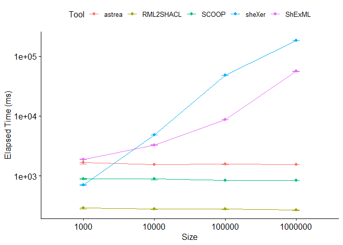

# Set up

``` r
dataset <- read.csv("C:/Users/Herminio/Git/shapes-generation-evaluation/statistics/resultEvaluationIncrementalFilms.csv", sep=';')[, 2:5]
datasetShEx <- dataset[(dataset$ShapesLanguage == "ShEx"), ]
datasetSHACL <- dataset[(dataset$ShapesLanguage == "SHACL"), ]
```

#Descriptive statistics for SHACL generation

``` r
stby(datasetSHACL, list(datasetSHACL$Tool, datasetSHACL$Size), descr, round.digits=5, stats=c("mean", "med", "sd", "min", "max"))
```

    ## Non-numerical variable(s) ignored: Tool, ShapesLanguage

    ## Descriptive Statistics  
    ## datasetSHACL  
    ## Group: Tool = astrea, Size = 1000  
    ## N: 30  
    ## 
    ##                 ElapseTime_ms         Size
    ## ------------- --------------- ------------
    ##          Mean      2004.53333   1000.00000
    ##        Median      1971.00000   1000.00000
    ##       Std.Dev       313.16512      0.00000
    ##           Min      1602.00000   1000.00000
    ##           Max      3255.00000   1000.00000
    ## 
    ## Group: Tool = RML2SHACL, Size = 1000  
    ## N: 30  
    ## 
    ##                 ElapseTime_ms         Size
    ## ------------- --------------- ------------
    ##          Mean       302.73333   1000.00000
    ##        Median       290.00000   1000.00000
    ##       Std.Dev        38.89325      0.00000
    ##           Min       270.00000   1000.00000
    ##           Max       477.00000   1000.00000
    ## 
    ## Group: Tool = sheXer, Size = 1000  
    ## N: 30  
    ## 
    ##                 ElapseTime_ms         Size
    ## ------------- --------------- ------------
    ##          Mean       777.66667   1000.00000
    ##        Median       764.00000   1000.00000
    ##       Std.Dev        63.40365      0.00000
    ##           Min       693.00000   1000.00000
    ##           Max       968.00000   1000.00000
    ## 
    ## Group: Tool = ShExML, Size = 1000  
    ## N: 30  
    ## 
    ##                 ElapseTime_ms         Size
    ## ------------- --------------- ------------
    ##          Mean      2066.03333   1000.00000
    ##        Median      2057.00000   1000.00000
    ##       Std.Dev        73.52198      0.00000
    ##           Min      1929.00000   1000.00000
    ##           Max      2250.00000   1000.00000
    ## 
    ## Group: Tool = astrea, Size = 10000  
    ## N: 30  
    ## 
    ##                 ElapseTime_ms          Size
    ## ------------- --------------- -------------
    ##          Mean      1803.43333   10000.00000
    ##        Median      1742.50000   10000.00000
    ##       Std.Dev       181.74550       0.00000
    ##           Min      1588.00000   10000.00000
    ##           Max      2380.00000   10000.00000
    ## 
    ## Group: Tool = RML2SHACL, Size = 10000  
    ## N: 30  
    ## 
    ##                 ElapseTime_ms          Size
    ## ------------- --------------- -------------
    ##          Mean       302.86667   10000.00000
    ##        Median       297.50000   10000.00000
    ##       Std.Dev        34.41404       0.00000
    ##           Min       260.00000   10000.00000
    ##           Max       382.00000   10000.00000
    ## 
    ## Group: Tool = sheXer, Size = 10000  
    ## N: 30  
    ## 
    ##                 ElapseTime_ms          Size
    ## ------------- --------------- -------------
    ##          Mean      4762.83333   10000.00000
    ##        Median      4748.00000   10000.00000
    ##       Std.Dev       121.78559       0.00000
    ##           Min      4521.00000   10000.00000
    ##           Max      4966.00000   10000.00000
    ## 
    ## Group: Tool = ShExML, Size = 10000  
    ## N: 30  
    ## 
    ##                 ElapseTime_ms          Size
    ## ------------- --------------- -------------
    ##          Mean      3343.03333   10000.00000
    ##        Median      3332.50000   10000.00000
    ##       Std.Dev       121.29630       0.00000
    ##           Min      3168.00000   10000.00000
    ##           Max      3640.00000   10000.00000
    ## 
    ## Group: Tool = astrea, Size = 100000  
    ## N: 30  
    ## 
    ##                 ElapseTime_ms           Size
    ## ------------- --------------- --------------
    ##          Mean      1767.63333   100000.00000
    ##        Median      1762.50000   100000.00000
    ##       Std.Dev       123.80003        0.00000
    ##           Min      1587.00000   100000.00000
    ##           Max      2139.00000   100000.00000
    ## 
    ## Group: Tool = RML2SHACL, Size = 100000  
    ## N: 30  
    ## 
    ##                 ElapseTime_ms           Size
    ## ------------- --------------- --------------
    ##          Mean       286.60000   100000.00000
    ##        Median       289.00000   100000.00000
    ##       Std.Dev        13.15583        0.00000
    ##           Min       257.00000   100000.00000
    ##           Max       316.00000   100000.00000
    ## 
    ## Group: Tool = sheXer, Size = 100000  
    ## N: 30  
    ## 
    ##                 ElapseTime_ms           Size
    ## ------------- --------------- --------------
    ##          Mean     52384.30000   100000.00000
    ##        Median     50926.00000   100000.00000
    ##       Std.Dev      3807.01494        0.00000
    ##           Min     48281.00000   100000.00000
    ##           Max     64821.00000   100000.00000
    ## 
    ## Group: Tool = ShExML, Size = 100000  
    ## N: 30  
    ## 
    ##                 ElapseTime_ms           Size
    ## ------------- --------------- --------------
    ##          Mean      9099.83333   100000.00000
    ##        Median      9076.00000   100000.00000
    ##       Std.Dev       329.03863        0.00000
    ##           Min      8346.00000   100000.00000
    ##           Max      9765.00000   100000.00000
    ## 
    ## Group: Tool = astrea, Size = 1000000  
    ## N: 30  
    ## 
    ##                 ElapseTime_ms            Size
    ## ------------- --------------- ---------------
    ##          Mean      1699.10000   1000000.00000
    ##        Median      1658.50000   1000000.00000
    ##       Std.Dev       129.18320         0.00000
    ##           Min      1540.00000   1000000.00000
    ##           Max      2119.00000   1000000.00000
    ## 
    ## Group: Tool = RML2SHACL, Size = 1000000  
    ## N: 30  
    ## 
    ##                 ElapseTime_ms            Size
    ## ------------- --------------- ---------------
    ##          Mean       265.90000   1000000.00000
    ##        Median       263.50000   1000000.00000
    ##       Std.Dev        15.91865         0.00000
    ##           Min       244.00000   1000000.00000
    ##           Max       304.00000   1000000.00000
    ## 
    ## Group: Tool = sheXer, Size = 1000000  
    ## N: 30  
    ## 
    ##                 ElapseTime_ms            Size
    ## ------------- --------------- ---------------
    ##          Mean    180151.60000   1000000.00000
    ##        Median    180150.00000   1000000.00000
    ##       Std.Dev        13.06113         0.00000
    ##           Min    180125.00000   1000000.00000
    ##           Max    180177.00000   1000000.00000
    ## 
    ## Group: Tool = ShExML, Size = 1000000  
    ## N: 30  
    ## 
    ##                 ElapseTime_ms            Size
    ## ------------- --------------- ---------------
    ##          Mean     72482.70000   1000000.00000
    ##        Median     72890.50000   1000000.00000
    ##       Std.Dev      5409.46161         0.00000
    ##           Min     60436.00000   1000000.00000
    ##           Max     84944.00000   1000000.00000

#Descriptive statistics for ShEx generation

``` r
stby(datasetShEx, list(datasetShEx$Tool, datasetShEx$Size), descr, round.digits=5, stats=c("mean", "med", "sd", "min", "max"))
```

    ## Non-numerical variable(s) ignored: Tool, ShapesLanguage

    ## Descriptive Statistics  
    ## datasetShEx  
    ## Group: Tool = sheXer, Size = 1000  
    ## N: 30  
    ## 
    ##                 ElapseTime_ms         Size
    ## ------------- --------------- ------------
    ##          Mean       892.63333   1000.00000
    ##        Median       841.00000   1000.00000
    ##       Std.Dev       310.00762      0.00000
    ##           Min       680.00000   1000.00000
    ##           Max      2461.00000   1000.00000
    ## 
    ## Group: Tool = ShExML, Size = 1000  
    ## N: 30  
    ## 
    ##                 ElapseTime_ms         Size
    ## ------------- --------------- ------------
    ##          Mean      1978.16667   1000.00000
    ##        Median      1947.00000   1000.00000
    ##       Std.Dev       130.36688      0.00000
    ##           Min      1877.00000   1000.00000
    ##           Max      2571.00000   1000.00000
    ## 
    ## Group: Tool = sheXer, Size = 10000  
    ## N: 30  
    ## 
    ##                 ElapseTime_ms          Size
    ## ------------- --------------- -------------
    ##          Mean      4969.83333   10000.00000
    ##        Median      4967.00000   10000.00000
    ##       Std.Dev       176.70413       0.00000
    ##           Min      4603.00000   10000.00000
    ##           Max      5333.00000   10000.00000
    ## 
    ## Group: Tool = ShExML, Size = 10000  
    ## N: 30  
    ## 
    ##                 ElapseTime_ms          Size
    ## ------------- --------------- -------------
    ##          Mean      3308.13333   10000.00000
    ##        Median      3297.00000   10000.00000
    ##       Std.Dev       131.08400       0.00000
    ##           Min      3096.00000   10000.00000
    ##           Max      3705.00000   10000.00000
    ## 
    ## Group: Tool = sheXer, Size = 100000  
    ## N: 30  
    ## 
    ##                 ElapseTime_ms           Size
    ## ------------- --------------- --------------
    ##          Mean     52122.86667   100000.00000
    ##        Median     50668.50000   100000.00000
    ##       Std.Dev      4411.30592        0.00000
    ##           Min     47212.00000   100000.00000
    ##           Max     66407.00000   100000.00000
    ## 
    ## Group: Tool = ShExML, Size = 100000  
    ## N: 30  
    ## 
    ##                 ElapseTime_ms           Size
    ## ------------- --------------- --------------
    ##          Mean      9078.40000   100000.00000
    ##        Median      9035.50000   100000.00000
    ##       Std.Dev       361.01988        0.00000
    ##           Min      8278.00000   100000.00000
    ##           Max      9985.00000   100000.00000
    ## 
    ## Group: Tool = sheXer, Size = 1000000  
    ## N: 30  
    ## 
    ##                 ElapseTime_ms            Size
    ## ------------- --------------- ---------------
    ##          Mean    180159.16667   1000000.00000
    ##        Median    180158.00000   1000000.00000
    ##       Std.Dev        18.46727         0.00000
    ##           Min    180135.00000   1000000.00000
    ##           Max    180208.00000   1000000.00000
    ## 
    ## Group: Tool = ShExML, Size = 1000000  
    ## N: 30  
    ## 
    ##                 ElapseTime_ms            Size
    ## ------------- --------------- ---------------
    ##          Mean     72095.90000   1000000.00000
    ##        Median     73307.50000   1000000.00000
    ##       Std.Dev      7547.88450         0.00000
    ##           Min     55283.00000   1000000.00000
    ##           Max     85016.00000   1000000.00000

# Testing normality for SHACL

``` r
by(datasetSHACL$ElapseTime_ms, list(datasetSHACL$Tool, datasetSHACL$Size), shapiro.test)
```

    ## : astrea
    ## : 1000
    ## 
    ##  Shapiro-Wilk normality test
    ## 
    ## data:  dd[x, ]
    ## W = 0.80291, p-value = 7.409e-05
    ## 
    ## ------------------------------------------------------------ 
    ## : RML2SHACL
    ## : 1000
    ## 
    ##  Shapiro-Wilk normality test
    ## 
    ## data:  dd[x, ]
    ## W = 0.64446, p-value = 2.666e-07
    ## 
    ## ------------------------------------------------------------ 
    ## : sheXer
    ## : 1000
    ## 
    ##  Shapiro-Wilk normality test
    ## 
    ## data:  dd[x, ]
    ## W = 0.88967, p-value = 0.004738
    ## 
    ## ------------------------------------------------------------ 
    ## : ShExML
    ## : 1000
    ## 
    ##  Shapiro-Wilk normality test
    ## 
    ## data:  dd[x, ]
    ## W = 0.97635, p-value = 0.7226
    ## 
    ## ------------------------------------------------------------ 
    ## : astrea
    ## : 10000
    ## 
    ##  Shapiro-Wilk normality test
    ## 
    ## data:  dd[x, ]
    ## W = 0.83622, p-value = 0.0003234
    ## 
    ## ------------------------------------------------------------ 
    ## : RML2SHACL
    ## : 10000
    ## 
    ##  Shapiro-Wilk normality test
    ## 
    ## data:  dd[x, ]
    ## W = 0.92983, p-value = 0.0486
    ## 
    ## ------------------------------------------------------------ 
    ## : sheXer
    ## : 10000
    ## 
    ##  Shapiro-Wilk normality test
    ## 
    ## data:  dd[x, ]
    ## W = 0.95982, p-value = 0.3066
    ## 
    ## ------------------------------------------------------------ 
    ## : ShExML
    ## : 10000
    ## 
    ##  Shapiro-Wilk normality test
    ## 
    ## data:  dd[x, ]
    ## W = 0.94731, p-value = 0.1432
    ## 
    ## ------------------------------------------------------------ 
    ## : astrea
    ## : 100000
    ## 
    ##  Shapiro-Wilk normality test
    ## 
    ## data:  dd[x, ]
    ## W = 0.94078, p-value = 0.09546
    ## 
    ## ------------------------------------------------------------ 
    ## : RML2SHACL
    ## : 100000
    ## 
    ##  Shapiro-Wilk normality test
    ## 
    ## data:  dd[x, ]
    ## W = 0.96398, p-value = 0.3898
    ## 
    ## ------------------------------------------------------------ 
    ## : sheXer
    ## : 100000
    ## 
    ##  Shapiro-Wilk normality test
    ## 
    ## data:  dd[x, ]
    ## W = 0.77466, p-value = 2.34e-05
    ## 
    ## ------------------------------------------------------------ 
    ## : ShExML
    ## : 100000
    ## 
    ##  Shapiro-Wilk normality test
    ## 
    ## data:  dd[x, ]
    ## W = 0.97254, p-value = 0.6107
    ## 
    ## ------------------------------------------------------------ 
    ## : astrea
    ## : 1000000
    ## 
    ##  Shapiro-Wilk normality test
    ## 
    ## data:  dd[x, ]
    ## W = 0.81526, p-value = 0.000126
    ## 
    ## ------------------------------------------------------------ 
    ## : RML2SHACL
    ## : 1000000
    ## 
    ##  Shapiro-Wilk normality test
    ## 
    ## data:  dd[x, ]
    ## W = 0.93492, p-value = 0.06645
    ## 
    ## ------------------------------------------------------------ 
    ## : sheXer
    ## : 1000000
    ## 
    ##  Shapiro-Wilk normality test
    ## 
    ## data:  dd[x, ]
    ## W = 0.98495, p-value = 0.9364
    ## 
    ## ------------------------------------------------------------ 
    ## : ShExML
    ## : 1000000
    ## 
    ##  Shapiro-Wilk normality test
    ## 
    ## data:  dd[x, ]
    ## W = 0.99443, p-value = 0.9998

# Testing normality for ShEx

``` r
by(datasetShEx$ElapseTime_ms, list(datasetShEx$Tool, datasetShEx$Size), shapiro.test)
```

    ## : sheXer
    ## : 1000
    ## 
    ##  Shapiro-Wilk normality test
    ## 
    ## data:  dd[x, ]
    ## W = 0.4187, p-value = 8.173e-10
    ## 
    ## ------------------------------------------------------------ 
    ## : ShExML
    ## : 1000
    ## 
    ##  Shapiro-Wilk normality test
    ## 
    ## data:  dd[x, ]
    ## W = 0.62144, p-value = 1.347e-07
    ## 
    ## ------------------------------------------------------------ 
    ## : sheXer
    ## : 10000
    ## 
    ##  Shapiro-Wilk normality test
    ## 
    ## data:  dd[x, ]
    ## W = 0.98875, p-value = 0.9833
    ## 
    ## ------------------------------------------------------------ 
    ## : ShExML
    ## : 10000
    ## 
    ##  Shapiro-Wilk normality test
    ## 
    ## data:  dd[x, ]
    ## W = 0.90284, p-value = 0.009863
    ## 
    ## ------------------------------------------------------------ 
    ## : sheXer
    ## : 100000
    ## 
    ##  Shapiro-Wilk normality test
    ## 
    ## data:  dd[x, ]
    ## W = 0.7289, p-value = 4.228e-06
    ## 
    ## ------------------------------------------------------------ 
    ## : ShExML
    ## : 100000
    ## 
    ##  Shapiro-Wilk normality test
    ## 
    ## data:  dd[x, ]
    ## W = 0.97718, p-value = 0.7467
    ## 
    ## ------------------------------------------------------------ 
    ## : sheXer
    ## : 1000000
    ## 
    ##  Shapiro-Wilk normality test
    ## 
    ## data:  dd[x, ]
    ## W = 0.92409, p-value = 0.03428
    ## 
    ## ------------------------------------------------------------ 
    ## : ShExML
    ## : 1000000
    ## 
    ##  Shapiro-Wilk normality test
    ## 
    ## data:  dd[x, ]
    ## W = 0.97504, p-value = 0.6838

# Running the ART tool including post hoc tests and effect size for SHACL

``` r
datasetSHACL$Size <- factor(datasetSHACL$Size)
datasetSHACL$Tool <- factor(datasetSHACL$Tool)

model = art(ElapseTime_ms ~ Tool + (1 | Size), data=datasetSHACL)
marginal = art.con(model, "Tool", adjust="tukey")

Result = anova(model)
Result$part.eta.sq = with(Result, `F` * `Df` / (`F` * `Df` + `Df.res`))
Result
```

    ## Analysis of Variance of Aligned Rank Transformed Data
    ## 
    ## Table Type: Analysis of Deviance Table (Type III Wald F tests with Kenward-Roger df) 
    ## Model: Mixed Effects (lmer)
    ## Response: art(ElapseTime_ms)
    ## 
    ##             F Df Df.res     Pr(>F) part.eta.sq    
    ## 1 Tool 503.12  3    473 < 2.22e-16      0.7614 ***
    ## ---
    ## Signif. codes:   0 '***' 0.001 '**' 0.01 '*' 0.05 '.' 0.1 ' ' 1

``` r
marginal
```

    ##  contrast           estimate   SE  df t.ratio p.value
    ##  astrea - RML2SHACL      154 8.49 473  18.137  <.0001
    ##  astrea - sheXer        -124 8.49 473 -14.561  <.0001
    ##  astrea - ShExML        -135 8.49 473 -15.855  <.0001
    ##  RML2SHACL - sheXer     -278 8.49 473 -32.698  <.0001
    ##  RML2SHACL - ShExML     -289 8.49 473 -33.993  <.0001
    ##  sheXer - ShExML         -11 8.49 473  -1.295  0.5669
    ## 
    ## Degrees-of-freedom method: kenward-roger 
    ## P value adjustment: tukey method for comparing a family of 4 estimates

``` r
lm = artlm(model, "Tool")
contrasts = summary(pairs(emmeans(lm, ~ Tool)))

contrasts$d = contrasts$estimate / sigmaHat(lm)
contrasts
```

    ##  contrast           estimate   SE  df t.ratio p.value      d
    ##  astrea - RML2SHACL      154 8.49 473  18.137  <.0001  2.342
    ##  astrea - sheXer        -124 8.49 473 -14.561  <.0001 -1.880
    ##  astrea - ShExML        -135 8.49 473 -15.855  <.0001 -2.047
    ##  RML2SHACL - sheXer     -278 8.49 473 -32.698  <.0001 -4.221
    ##  RML2SHACL - ShExML     -289 8.49 473 -33.993  <.0001 -4.388
    ##  sheXer - ShExML         -11 8.49 473  -1.295  0.5669 -0.167
    ## 
    ## Degrees-of-freedom method: kenward-roger 
    ## P value adjustment: tukey method for comparing a family of 4 estimates

# Comparing ShExML and sheXer by Elapsed Time and Size using the ART tool on incremental SHACL generation

``` r
datasetSHACL$Size <- factor(datasetSHACL$Size)
datasetSHACL$Tool <- factor(datasetSHACL$Tool)

model = art(ElapseTime_ms ~ Tool + Size + Tool:Size, data=datasetSHACL[(datasetSHACL$Tool == "ShExML" | datasetSHACL$Tool == "sheXer"), ])
marginal = art.con(model, "Tool:Size", adjust="tukey")

Result = anova(model)
Result$part.eta.sq = with(Result, `Sum Sq`/(`Sum Sq` + `Sum Sq.res`))
Result
```

    ## Analysis of Variance of Aligned Rank Transformed Data
    ## 
    ## Table Type: Anova Table (Type III tests) 
    ## Model: No Repeated Measures (lm)
    ## Response: art(ElapseTime_ms)
    ## 
    ##             Df Df.res F value     Pr(>F) part.eta.sq    
    ## 1 Tool       1    232  707.62 < 2.22e-16     0.75309 ***
    ## 2 Size       3    232 1174.14 < 2.22e-16     0.93821 ***
    ## 3 Tool:Size  3    232 4878.37 < 2.22e-16     0.98440 ***
    ## ---
    ## Signif. codes:   0 '***' 0.001 '**' 0.01 '*' 0.05 '.' 0.1 ' ' 1

``` r
lm = artlm(model, "Tool:Size")
contrasts = summary(pairs(emmeans(lm, ~ Tool:Size)))

contrasts$d = contrasts$estimate / sigmaHat(lm)
contrasts
```

    ##  contrast                                estimate   SE  df t.ratio p.value
    ##  sheXer Size1000 - ShExML Size1000           -150 2.27 232 -65.998  <.0001
    ##  sheXer Size1000 - sheXer Size10000           -30 2.27 232 -13.200  <.0001
    ##  sheXer Size1000 - ShExML Size10000          -120 2.27 232 -52.798  <.0001
    ##  sheXer Size1000 - sheXer Size100000          -90 2.27 232 -39.599  <.0001
    ##  sheXer Size1000 - ShExML Size100000          -60 2.27 232 -26.399  <.0001
    ##  sheXer Size1000 - sheXer Size1000000        -180 2.27 232 -79.197  <.0001
    ##  sheXer Size1000 - ShExML Size1000000          30 2.27 232  13.200  <.0001
    ##  ShExML Size1000 - sheXer Size10000           120 2.27 232  52.798  <.0001
    ##  ShExML Size1000 - ShExML Size10000            30 2.27 232  13.200  <.0001
    ##  ShExML Size1000 - sheXer Size100000           60 2.27 232  26.399  <.0001
    ##  ShExML Size1000 - ShExML Size100000           90 2.27 232  39.599  <.0001
    ##  ShExML Size1000 - sheXer Size1000000         -30 2.27 232 -13.200  <.0001
    ##  ShExML Size1000 - ShExML Size1000000         180 2.27 232  79.197  <.0001
    ##  sheXer Size10000 - ShExML Size10000          -90 2.27 232 -39.599  <.0001
    ##  sheXer Size10000 - sheXer Size100000         -60 2.27 232 -26.399  <.0001
    ##  sheXer Size10000 - ShExML Size100000         -30 2.27 232 -13.200  <.0001
    ##  sheXer Size10000 - sheXer Size1000000       -150 2.27 232 -65.998  <.0001
    ##  sheXer Size10000 - ShExML Size1000000         60 2.27 232  26.399  <.0001
    ##  ShExML Size10000 - sheXer Size100000          30 2.27 232  13.200  <.0001
    ##  ShExML Size10000 - ShExML Size100000          60 2.27 232  26.399  <.0001
    ##  ShExML Size10000 - sheXer Size1000000        -60 2.27 232 -26.399  <.0001
    ##  ShExML Size10000 - ShExML Size1000000        150 2.27 232  65.998  <.0001
    ##  sheXer Size100000 - ShExML Size100000         30 2.27 232  13.200  <.0001
    ##  sheXer Size100000 - sheXer Size1000000       -90 2.27 232 -39.599  <.0001
    ##  sheXer Size100000 - ShExML Size1000000       120 2.27 232  52.798  <.0001
    ##  ShExML Size100000 - sheXer Size1000000      -120 2.27 232 -52.798  <.0001
    ##  ShExML Size100000 - ShExML Size1000000        90 2.27 232  39.599  <.0001
    ##  sheXer Size1000000 - ShExML Size1000000      210 2.27 232  92.397  <.0001
    ##       d
    ##  -17.04
    ##   -3.41
    ##  -13.63
    ##  -10.22
    ##   -6.82
    ##  -20.45
    ##    3.41
    ##   13.63
    ##    3.41
    ##    6.82
    ##   10.22
    ##   -3.41
    ##   20.45
    ##  -10.22
    ##   -6.82
    ##   -3.41
    ##  -17.04
    ##    6.82
    ##    3.41
    ##    6.82
    ##   -6.82
    ##   17.04
    ##    3.41
    ##  -10.22
    ##   13.63
    ##  -13.63
    ##   10.22
    ##   23.86
    ## 
    ## P value adjustment: tukey method for comparing a family of 8 estimates

# Running the ART tool including post hoc tests and effect size for ShEx

``` r
datasetShEx$Size <- factor(datasetShEx$Size)
datasetShEx$Tool <- factor(datasetShEx$Tool)

model = art(ElapseTime_ms ~ Tool + (1 | Size), data=datasetShEx)
marginal = art.con(model, "Tool", adjust="tukey")

Result = anova(model)
Result$part.eta.sq = with(Result, `F` * `Df` / (`F` * `Df` + `Df.res`))
Result
```

    ## Analysis of Variance of Aligned Rank Transformed Data
    ## 
    ## Table Type: Analysis of Deviance Table (Type III Wald F tests with Kenward-Roger df) 
    ## Model: Mixed Effects (lmer)
    ## Response: art(ElapseTime_ms)
    ## 
    ##             F Df Df.res     Pr(>F) part.eta.sq    
    ## 1 Tool 59.325  1    235 3.7154e-13     0.20156 ***
    ## ---
    ## Signif. codes:   0 '***' 0.001 '**' 0.01 '*' 0.05 '.' 0.1 ' ' 1

``` r
marginal
```

    ##  contrast        estimate   SE  df t.ratio p.value
    ##  sheXer - ShExML     15.8 2.05 235   7.702  <.0001
    ## 
    ## Degrees-of-freedom method: kenward-roger

``` r
lm = artlm(model, "Tool")
contrasts = summary(pairs(emmeans(lm, ~ Tool)))

contrasts$d = contrasts$estimate / sigmaHat(lm)
contrasts
```

    ##  contrast        estimate   SE  df t.ratio p.value     d
    ##  sheXer - ShExML     15.8 2.05 235   7.702  <.0001 0.994
    ## 
    ## Degrees-of-freedom method: kenward-roger

# Comparing ShExML and sheXer by Elapsed Time and Size using the ART tool on incremental ShEx generation

``` r
datasetShEx$Size <- factor(datasetShEx$Size)
datasetShEx$Tool <- factor(datasetShEx$Tool)

model = art(ElapseTime_ms ~ Tool + Size + Tool:Size, data=datasetShEx)
marginal = art.con(model, "Tool:Size", adjust="tukey")

Result = anova(model)
Result$part.eta.sq = with(Result, `Sum Sq`/(`Sum Sq` + `Sum Sq.res`))
Result
```

    ## Analysis of Variance of Aligned Rank Transformed Data
    ## 
    ## Table Type: Anova Table (Type III tests) 
    ## Model: No Repeated Measures (lm)
    ## Response: art(ElapseTime_ms)
    ## 
    ##             Df Df.res F value     Pr(>F) part.eta.sq    
    ## 1 Tool       1    232  781.92 < 2.22e-16     0.77118 ***
    ## 2 Size       3    232 1251.44 < 2.22e-16     0.94180 ***
    ## 3 Tool:Size  3    232 4399.42 < 2.22e-16     0.98273 ***
    ## ---
    ## Signif. codes:   0 '***' 0.001 '**' 0.01 '*' 0.05 '.' 0.1 ' ' 1

``` r
lm = artlm(model, "Tool:Size")
contrasts = summary(pairs(emmeans(lm, ~ Tool:Size)))

contrasts$d = contrasts$estimate / sigmaHat(lm)
contrasts
```

    ##  contrast                                estimate   SE  df t.ratio p.value
    ##  sheXer Size1000 - ShExML Size1000         -149.1 2.39 232 -62.366  <.0001
    ##  sheXer Size1000 - sheXer Size10000         -28.3 2.39 232 -11.821  <.0001
    ##  sheXer Size1000 - ShExML Size10000        -119.1 2.39 232 -49.820  <.0001
    ##  sheXer Size1000 - sheXer Size100000        -88.9 2.39 232 -37.177  <.0001
    ##  sheXer Size1000 - ShExML Size100000        -59.4 2.39 232 -24.826  <.0001
    ##  sheXer Size1000 - sheXer Size1000000      -179.1 2.39 232 -74.912  <.0001
    ##  sheXer Size1000 - ShExML Size1000000        30.9 2.39 232  12.908  <.0001
    ##  ShExML Size1000 - sheXer Size10000         120.9 2.39 232  50.545  <.0001
    ##  ShExML Size1000 - ShExML Size10000          30.0 2.39 232  12.546  <.0001
    ##  ShExML Size1000 - sheXer Size100000         60.2 2.39 232  25.189  <.0001
    ##  ShExML Size1000 - ShExML Size100000         89.8 2.39 232  37.539  <.0001
    ##  ShExML Size1000 - sheXer Size1000000       -30.0 2.39 232 -12.546  <.0001
    ##  ShExML Size1000 - ShExML Size1000000       180.0 2.39 232  75.274  <.0001
    ##  sheXer Size10000 - ShExML Size10000        -90.9 2.39 232 -37.999  <.0001
    ##  sheXer Size10000 - sheXer Size100000       -60.6 2.39 232 -25.356  <.0001
    ##  sheXer Size10000 - ShExML Size100000       -31.1 2.39 232 -13.006  <.0001
    ##  sheXer Size10000 - sheXer Size1000000     -150.9 2.39 232 -63.091  <.0001
    ##  sheXer Size10000 - ShExML Size1000000       59.1 2.39 232  24.729  <.0001
    ##  ShExML Size10000 - sheXer Size100000        30.2 2.39 232  12.643  <.0001
    ##  ShExML Size10000 - ShExML Size100000        59.8 2.39 232  24.994  <.0001
    ##  ShExML Size10000 - sheXer Size1000000      -60.0 2.39 232 -25.091  <.0001
    ##  ShExML Size10000 - ShExML Size1000000      150.0 2.39 232  62.728  <.0001
    ##  sheXer Size100000 - ShExML Size100000       29.5 2.39 232  12.350  <.0001
    ##  sheXer Size100000 - sheXer Size1000000     -90.2 2.39 232 -37.735  <.0001
    ##  sheXer Size100000 - ShExML Size1000000     119.8 2.39 232  50.085  <.0001
    ##  ShExML Size100000 - sheXer Size1000000    -119.8 2.39 232 -50.085  <.0001
    ##  ShExML Size100000 - ShExML Size1000000      90.2 2.39 232  37.735  <.0001
    ##  sheXer Size1000000 - ShExML Size1000000    210.0 2.39 232  87.820  <.0001
    ##       d
    ##  -16.10
    ##   -3.05
    ##  -12.86
    ##   -9.60
    ##   -6.41
    ##  -19.34
    ##    3.33
    ##   13.05
    ##    3.24
    ##    6.50
    ##    9.69
    ##   -3.24
    ##   19.44
    ##   -9.81
    ##   -6.55
    ##   -3.36
    ##  -16.29
    ##    6.38
    ##    3.26
    ##    6.45
    ##   -6.48
    ##   16.20
    ##    3.19
    ##   -9.74
    ##   12.93
    ##  -12.93
    ##    9.74
    ##   22.67
    ## 
    ## P value adjustment: tukey method for comparing a family of 8 estimates

# Setting up the logarithmic scale

``` r
datasetSHACLLog <- datasetSHACL
datasetSHACLLog$ElapseTime_ms <- log(datasetSHACLLog$ElapseTime_ms)

datasetShExLog <- datasetShEx
datasetShExLog$ElapseTime_ms <- log(datasetShExLog$ElapseTime_ms)
```

# Comparing liner scale on SHACL

``` r
ggline(datasetSHACL, x = "Size",
      y = "ElapseTime_ms",
      color = "Tool",
      add = "mean_sd")
```


\# Comparing logarithmic scale on SHACL

``` r
ggline(datasetSHACLLog, x = "Size",
      y = "ElapseTime_ms",
      ylab = "Elapsed Time (log(ms))",
      color = "Tool",
      add = "mean_sd")
```


# Comparing linear scale on ShEx

``` r
ggline(datasetShEx, x = "Size",
      y = "ElapseTime_ms",
      color = "Tool",
      add = "mean_sd")
```


\# Comparing logarithmic scale on ShEx

``` r
ggline(datasetShExLog, x = "Size",
      y = "ElapseTime_ms",
      ylab = "Elapsed Time (log(ms))",
      color = "Tool",
      add = "mean_sd")
```


