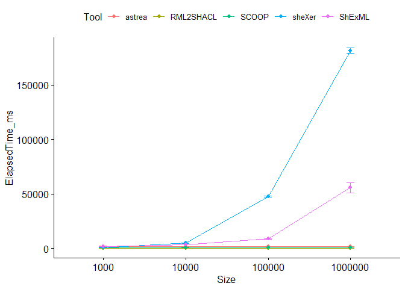

# Set up

``` r
dataset <- read.csv("C:/Users/Herminio/Git/shapes-generation-evaluation/statistics/resultEvaluationIncrementalFilms.csv", sep=';')[, 2:5]
datasetShEx <- dataset[(dataset$ShapesLanguage == "ShEx"), ]
datasetSHACL <- dataset[(dataset$ShapesLanguage == "SHACL"), ]
```

# Descriptive statistics for SHACL generation

``` r
stby(datasetSHACL, list(datasetSHACL$Tool, datasetSHACL$Size), descr, round.digits=5, stats=c("mean", "med", "sd", "min", "max"))
```

    ## Non-numerical variable(s) ignored: Tool, ShapesLanguage

    ## Descriptive Statistics  
    ## datasetSHACL  
    ## Group: Tool = astrea, Size = 1000  
    ## N: 30  
    ## 
    ##                 ElapsedTime_ms         Size
    ## ------------- ---------------- ------------
    ##          Mean       1666.30000   1000.00000
    ##        Median       1560.00000   1000.00000
    ##       Std.Dev        489.08663      0.00000
    ##           Min       1463.00000   1000.00000
    ##           Max       4226.00000   1000.00000
    ## 
    ## Group: Tool = RML2SHACL, Size = 1000  
    ## N: 30  
    ## 
    ##                 ElapsedTime_ms         Size
    ## ------------- ---------------- ------------
    ##          Mean        289.36667   1000.00000
    ##        Median        282.00000   1000.00000
    ##       Std.Dev         28.02768      0.00000
    ##           Min        264.00000   1000.00000
    ##           Max        388.00000   1000.00000
    ## 
    ## Group: Tool = SCOOP, Size = 1000  
    ## N: 30  
    ## 
    ##                 ElapsedTime_ms         Size
    ## ------------- ---------------- ------------
    ##          Mean        892.06667   1000.00000
    ##        Median        878.50000   1000.00000
    ##       Std.Dev        117.30800      0.00000
    ##           Min        818.00000   1000.00000
    ##           Max       1490.00000   1000.00000
    ## 
    ## Group: Tool = sheXer, Size = 1000  
    ## N: 30  
    ## 
    ##                 ElapsedTime_ms         Size
    ## ------------- ---------------- ------------
    ##          Mean        707.53333   1000.00000
    ##        Median        698.50000   1000.00000
    ##       Std.Dev         58.87317      0.00000
    ##           Min        628.00000   1000.00000
    ##           Max        873.00000   1000.00000
    ## 
    ## Group: Tool = ShExML, Size = 1000  
    ## N: 30  
    ## 
    ##                 ElapsedTime_ms         Size
    ## ------------- ---------------- ------------
    ##          Mean       1900.93333   1000.00000
    ##        Median       1902.50000   1000.00000
    ##       Std.Dev         38.30723      0.00000
    ##           Min       1816.00000   1000.00000
    ##           Max       1972.00000   1000.00000
    ## 
    ## Group: Tool = astrea, Size = 10000  
    ## N: 30  
    ## 
    ##                 ElapsedTime_ms          Size
    ## ------------- ---------------- -------------
    ##          Mean       1542.83333   10000.00000
    ##        Median       1543.00000   10000.00000
    ##       Std.Dev         33.12784       0.00000
    ##           Min       1469.00000   10000.00000
    ##           Max       1605.00000   10000.00000
    ## 
    ## Group: Tool = RML2SHACL, Size = 10000  
    ## N: 30  
    ## 
    ##                 ElapsedTime_ms          Size
    ## ------------- ---------------- -------------
    ##          Mean        279.76667   10000.00000
    ##        Median        278.00000   10000.00000
    ##       Std.Dev          9.04656       0.00000
    ##           Min        264.00000   10000.00000
    ##           Max        304.00000   10000.00000
    ## 
    ## Group: Tool = SCOOP, Size = 10000  
    ## N: 30  
    ## 
    ##                 ElapsedTime_ms          Size
    ## ------------- ---------------- -------------
    ##          Mean        886.46667   10000.00000
    ##        Median        849.50000   10000.00000
    ##       Std.Dev        184.40655       0.00000
    ##           Min        788.00000   10000.00000
    ##           Max       1850.00000   10000.00000
    ## 
    ## Group: Tool = sheXer, Size = 10000  
    ## N: 30  
    ## 
    ##                 ElapsedTime_ms          Size
    ## ------------- ---------------- -------------
    ##          Mean       4832.23333   10000.00000
    ##        Median       4823.50000   10000.00000
    ##       Std.Dev        155.74486       0.00000
    ##           Min       4557.00000   10000.00000
    ##           Max       5332.00000   10000.00000
    ## 
    ## Group: Tool = ShExML, Size = 10000  
    ## N: 30  
    ## 
    ##                 ElapsedTime_ms          Size
    ## ------------- ---------------- -------------
    ##          Mean       3280.56667   10000.00000
    ##        Median       3264.50000   10000.00000
    ##       Std.Dev         83.23531       0.00000
    ##           Min       3139.00000   10000.00000
    ##           Max       3477.00000   10000.00000
    ## 
    ## Group: Tool = astrea, Size = 100000  
    ## N: 30  
    ## 
    ##                 ElapsedTime_ms           Size
    ## ------------- ---------------- --------------
    ##          Mean       1569.40000   100000.00000
    ##        Median       1578.00000   100000.00000
    ##       Std.Dev         37.96605        0.00000
    ##           Min       1447.00000   100000.00000
    ##           Max       1620.00000   100000.00000
    ## 
    ## Group: Tool = RML2SHACL, Size = 100000  
    ## N: 30  
    ## 
    ##                 ElapsedTime_ms           Size
    ## ------------- ---------------- --------------
    ##          Mean        278.83333   100000.00000
    ##        Median        270.00000   100000.00000
    ##       Std.Dev         29.15841        0.00000
    ##           Min        253.00000   100000.00000
    ##           Max        392.00000   100000.00000
    ## 
    ## Group: Tool = SCOOP, Size = 100000  
    ## N: 30  
    ## 
    ##                 ElapsedTime_ms           Size
    ## ------------- ---------------- --------------
    ##          Mean        844.06667   100000.00000
    ##        Median        847.00000   100000.00000
    ##       Std.Dev         36.45775        0.00000
    ##           Min        774.00000   100000.00000
    ##           Max        907.00000   100000.00000
    ## 
    ## Group: Tool = sheXer, Size = 100000  
    ## N: 30  
    ## 
    ##                 ElapsedTime_ms           Size
    ## ------------- ---------------- --------------
    ##          Mean      47564.16667   100000.00000
    ##        Median      47647.50000   100000.00000
    ##       Std.Dev        415.36001        0.00000
    ##           Min      46523.00000   100000.00000
    ##           Max      48328.00000   100000.00000
    ## 
    ## Group: Tool = ShExML, Size = 100000  
    ## N: 30  
    ## 
    ##                 ElapsedTime_ms           Size
    ## ------------- ---------------- --------------
    ##          Mean       8719.00000   100000.00000
    ##        Median       8639.00000   100000.00000
    ##       Std.Dev        368.21630        0.00000
    ##           Min       8008.00000   100000.00000
    ##           Max       9716.00000   100000.00000
    ## 
    ## Group: Tool = astrea, Size = 1000000  
    ## N: 30  
    ## 
    ##                 ElapsedTime_ms            Size
    ## ------------- ---------------- ---------------
    ##          Mean       1546.16667   1000000.00000
    ##        Median       1548.00000   1000000.00000
    ##       Std.Dev         25.23692         0.00000
    ##           Min       1493.00000   1000000.00000
    ##           Max       1615.00000   1000000.00000
    ## 
    ## Group: Tool = RML2SHACL, Size = 1000000  
    ## N: 30  
    ## 
    ##                 ElapsedTime_ms            Size
    ## ------------- ---------------- ---------------
    ##          Mean        268.53333   1000000.00000
    ##        Median        266.50000   1000000.00000
    ##       Std.Dev         11.63447         0.00000
    ##           Min        253.00000   1000000.00000
    ##           Max        309.00000   1000000.00000
    ## 
    ## Group: Tool = SCOOP, Size = 1000000  
    ## N: 30  
    ## 
    ##                 ElapsedTime_ms            Size
    ## ------------- ---------------- ---------------
    ##          Mean        844.93333   1000000.00000
    ##        Median        842.50000   1000000.00000
    ##       Std.Dev         29.17242         0.00000
    ##           Min        790.00000   1000000.00000
    ##           Max        896.00000   1000000.00000
    ## 
    ## Group: Tool = sheXer, Size = 1000000  
    ## N: 30  
    ## 
    ##                 ElapsedTime_ms            Size
    ## ------------- ---------------- ---------------
    ##          Mean     181386.20000   1000000.00000
    ##        Median     180154.00000   1000000.00000
    ##       Std.Dev       2608.44641         0.00000
    ##           Min     180116.00000   1000000.00000
    ##           Max     187791.00000   1000000.00000
    ## 
    ## Group: Tool = ShExML, Size = 1000000  
    ## N: 30  
    ## 
    ##                 ElapsedTime_ms            Size
    ## ------------- ---------------- ---------------
    ##          Mean      55747.86667   1000000.00000
    ##        Median      55581.50000   1000000.00000
    ##       Std.Dev       4574.68749         0.00000
    ##           Min      46428.00000   1000000.00000
    ##           Max      66091.00000   1000000.00000

# Descriptive statistics for ShEx generation

``` r
stby(datasetShEx, list(datasetShEx$Tool, datasetShEx$Size), descr, round.digits=5, stats=c("mean", "med", "sd", "min", "max"))
```

    ## Non-numerical variable(s) ignored: Tool, ShapesLanguage

    ## Descriptive Statistics  
    ## datasetShEx  
    ## Group: Tool = sheXer, Size = 1000  
    ## N: 30  
    ## 
    ##                 ElapsedTime_ms         Size
    ## ------------- ---------------- ------------
    ##          Mean        776.63333   1000.00000
    ##        Median        767.50000   1000.00000
    ##       Std.Dev        103.28484      0.00000
    ##           Min        658.00000   1000.00000
    ##           Max       1265.00000   1000.00000
    ## 
    ## Group: Tool = ShExML, Size = 1000  
    ## N: 30  
    ## 
    ##                 ElapsedTime_ms         Size
    ## ------------- ---------------- ------------
    ##          Mean       1853.40000   1000.00000
    ##        Median       1834.00000   1000.00000
    ##       Std.Dev        129.61684      0.00000
    ##           Min       1742.00000   1000.00000
    ##           Max       2505.00000   1000.00000
    ## 
    ## Group: Tool = sheXer, Size = 10000  
    ## N: 30  
    ## 
    ##                 ElapsedTime_ms          Size
    ## ------------- ---------------- -------------
    ##          Mean       4957.63333   10000.00000
    ##        Median       4861.00000   10000.00000
    ##       Std.Dev        284.71383       0.00000
    ##           Min       4595.00000   10000.00000
    ##           Max       5917.00000   10000.00000
    ## 
    ## Group: Tool = ShExML, Size = 10000  
    ## N: 30  
    ## 
    ##                 ElapsedTime_ms          Size
    ## ------------- ---------------- -------------
    ##          Mean       3207.00000   10000.00000
    ##        Median       3207.50000   10000.00000
    ##       Std.Dev         77.74583       0.00000
    ##           Min       3079.00000   10000.00000
    ##           Max       3351.00000   10000.00000
    ## 
    ## Group: Tool = sheXer, Size = 100000  
    ## N: 30  
    ## 
    ##                 ElapsedTime_ms           Size
    ## ------------- ---------------- --------------
    ##          Mean      47497.73333   100000.00000
    ##        Median      47526.00000   100000.00000
    ##       Std.Dev        359.27944        0.00000
    ##           Min      46743.00000   100000.00000
    ##           Max      48181.00000   100000.00000
    ## 
    ## Group: Tool = ShExML, Size = 100000  
    ## N: 30  
    ## 
    ##                 ElapsedTime_ms           Size
    ## ------------- ---------------- --------------
    ##          Mean       8600.86667   100000.00000
    ##        Median       8541.00000   100000.00000
    ##       Std.Dev        381.50607        0.00000
    ##           Min       8014.00000   100000.00000
    ##           Max       9692.00000   100000.00000
    ## 
    ## Group: Tool = sheXer, Size = 1000000  
    ## N: 30  
    ## 
    ##                 ElapsedTime_ms            Size
    ## ------------- ---------------- ---------------
    ##          Mean     180630.73333   1000000.00000
    ##        Median     180155.00000   1000000.00000
    ##       Std.Dev       1861.62678         0.00000
    ##           Min     180127.00000   1000000.00000
    ##           Max     188807.00000   1000000.00000
    ## 
    ## Group: Tool = ShExML, Size = 1000000  
    ## N: 30  
    ## 
    ##                 ElapsedTime_ms            Size
    ## ------------- ---------------- ---------------
    ##          Mean      58493.23333   1000000.00000
    ##        Median      55314.00000   1000000.00000
    ##       Std.Dev      13412.09117         0.00000
    ##           Min      47460.00000   1000000.00000
    ##           Max     123493.00000   1000000.00000

# Testing normality for SHACL

``` r
by(datasetSHACL$ElapsedTime_ms, list(datasetSHACL$Tool, datasetSHACL$Size), shapiro.test)
```

    ## : astrea
    ## : 1000
    ## 
    ##  Shapiro-Wilk normality test
    ## 
    ## data:  dd[x, ]
    ## W = 0.30282, p-value = 7.452e-11
    ## 
    ## ------------------------------------------------------------ 
    ## : RML2SHACL
    ## : 1000
    ## 
    ##  Shapiro-Wilk normality test
    ## 
    ## data:  dd[x, ]
    ## W = 0.73264, p-value = 4.831e-06
    ## 
    ## ------------------------------------------------------------ 
    ## : SCOOP
    ## : 1000
    ## 
    ##  Shapiro-Wilk normality test
    ## 
    ## data:  dd[x, ]
    ## W = 0.42082, p-value = 8.564e-10
    ## 
    ## ------------------------------------------------------------ 
    ## : sheXer
    ## : 1000
    ## 
    ##  Shapiro-Wilk normality test
    ## 
    ## data:  dd[x, ]
    ## W = 0.89174, p-value = 0.005305
    ## 
    ## ------------------------------------------------------------ 
    ## : ShExML
    ## : 1000
    ## 
    ##  Shapiro-Wilk normality test
    ## 
    ## data:  dd[x, ]
    ## W = 0.97674, p-value = 0.7338
    ## 
    ## ------------------------------------------------------------ 
    ## : astrea
    ## : 10000
    ## 
    ##  Shapiro-Wilk normality test
    ## 
    ## data:  dd[x, ]
    ## W = 0.96636, p-value = 0.445
    ## 
    ## ------------------------------------------------------------ 
    ## : RML2SHACL
    ## : 10000
    ## 
    ##  Shapiro-Wilk normality test
    ## 
    ## data:  dd[x, ]
    ## W = 0.96518, p-value = 0.417
    ## 
    ## ------------------------------------------------------------ 
    ## : SCOOP
    ## : 10000
    ## 
    ##  Shapiro-Wilk normality test
    ## 
    ## data:  dd[x, ]
    ## W = 0.31617, p-value = 9.678e-11
    ## 
    ## ------------------------------------------------------------ 
    ## : sheXer
    ## : 10000
    ## 
    ##  Shapiro-Wilk normality test
    ## 
    ## data:  dd[x, ]
    ## W = 0.94101, p-value = 0.09686
    ## 
    ## ------------------------------------------------------------ 
    ## : ShExML
    ## : 10000
    ## 
    ##  Shapiro-Wilk normality test
    ## 
    ## data:  dd[x, ]
    ## W = 0.95721, p-value = 0.2623
    ## 
    ## ------------------------------------------------------------ 
    ## : astrea
    ## : 100000
    ## 
    ##  Shapiro-Wilk normality test
    ## 
    ## data:  dd[x, ]
    ## W = 0.91239, p-value = 0.0171
    ## 
    ## ------------------------------------------------------------ 
    ## : RML2SHACL
    ## : 100000
    ## 
    ##  Shapiro-Wilk normality test
    ## 
    ## data:  dd[x, ]
    ## W = 0.68174, p-value = 8.553e-07
    ## 
    ## ------------------------------------------------------------ 
    ## : SCOOP
    ## : 100000
    ## 
    ##  Shapiro-Wilk normality test
    ## 
    ## data:  dd[x, ]
    ## W = 0.96812, p-value = 0.4891
    ## 
    ## ------------------------------------------------------------ 
    ## : sheXer
    ## : 100000
    ## 
    ##  Shapiro-Wilk normality test
    ## 
    ## data:  dd[x, ]
    ## W = 0.92466, p-value = 0.0355
    ## 
    ## ------------------------------------------------------------ 
    ## : ShExML
    ## : 100000
    ## 
    ##  Shapiro-Wilk normality test
    ## 
    ## data:  dd[x, ]
    ## W = 0.95751, p-value = 0.2671
    ## 
    ## ------------------------------------------------------------ 
    ## : astrea
    ## : 1000000
    ## 
    ##  Shapiro-Wilk normality test
    ## 
    ## data:  dd[x, ]
    ## W = 0.97639, p-value = 0.7237
    ## 
    ## ------------------------------------------------------------ 
    ## : RML2SHACL
    ## : 1000000
    ## 
    ##  Shapiro-Wilk normality test
    ## 
    ## data:  dd[x, ]
    ## W = 0.79737, p-value = 5.874e-05
    ## 
    ## ------------------------------------------------------------ 
    ## : SCOOP
    ## : 1000000
    ## 
    ##  Shapiro-Wilk normality test
    ## 
    ## data:  dd[x, ]
    ## W = 0.95748, p-value = 0.2667
    ## 
    ## ------------------------------------------------------------ 
    ## : sheXer
    ## : 1000000
    ## 
    ##  Shapiro-Wilk normality test
    ## 
    ## data:  dd[x, ]
    ## W = 0.52098, p-value = 8.992e-09
    ## 
    ## ------------------------------------------------------------ 
    ## : ShExML
    ## : 1000000
    ## 
    ##  Shapiro-Wilk normality test
    ## 
    ## data:  dd[x, ]
    ## W = 0.98303, p-value = 0.8991

# Testing normality for ShEx

``` r
by(datasetShEx$ElapsedTime_ms, list(datasetShEx$Tool, datasetShEx$Size), shapiro.test)
```

    ## : sheXer
    ## : 1000
    ## 
    ##  Shapiro-Wilk normality test
    ## 
    ## data:  dd[x, ]
    ## W = 0.61379, p-value = 1.08e-07
    ## 
    ## ------------------------------------------------------------ 
    ## : ShExML
    ## : 1000
    ## 
    ##  Shapiro-Wilk normality test
    ## 
    ## data:  dd[x, ]
    ## W = 0.4676, p-value = 2.475e-09
    ## 
    ## ------------------------------------------------------------ 
    ## : sheXer
    ## : 10000
    ## 
    ##  Shapiro-Wilk normality test
    ## 
    ## data:  dd[x, ]
    ## W = 0.84407, p-value = 0.0004671
    ## 
    ## ------------------------------------------------------------ 
    ## : ShExML
    ## : 10000
    ## 
    ##  Shapiro-Wilk normality test
    ## 
    ## data:  dd[x, ]
    ## W = 0.95793, p-value = 0.2739
    ## 
    ## ------------------------------------------------------------ 
    ## : sheXer
    ## : 100000
    ## 
    ##  Shapiro-Wilk normality test
    ## 
    ## data:  dd[x, ]
    ## W = 0.98476, p-value = 0.9331
    ## 
    ## ------------------------------------------------------------ 
    ## : ShExML
    ## : 100000
    ## 
    ##  Shapiro-Wilk normality test
    ## 
    ## data:  dd[x, ]
    ## W = 0.9019, p-value = 0.009352
    ## 
    ## ------------------------------------------------------------ 
    ## : sheXer
    ## : 1000000
    ## 
    ##  Shapiro-Wilk normality test
    ## 
    ## data:  dd[x, ]
    ## W = 0.28636, p-value = 5.425e-11
    ## 
    ## ------------------------------------------------------------ 
    ## : ShExML
    ## : 1000000
    ## 
    ##  Shapiro-Wilk normality test
    ## 
    ## data:  dd[x, ]
    ## W = 0.55447, p-value = 2.121e-08

# Running the ART tool including post hoc tests and effect sizes for SHACL

``` r
datasetSHACL$Size <- factor(datasetSHACL$Size)
datasetSHACL$Tool <- factor(datasetSHACL$Tool)

model = art(ElapsedTime_ms ~ Tool + (1 | Size), data=datasetSHACL)
marginal = art.con(model, "Tool", adjust="tukey")

Result = anova(model)
Result$part.eta.sq = with(Result, `F` * `Df` / (`F` * `Df` + `Df.res`))
Result
```

    ## Analysis of Variance of Aligned Rank Transformed Data
    ## 
    ## Table Type: Analysis of Deviance Table (Type III Wald F tests with Kenward-Roger df) 
    ## Model: Mixed Effects (lmer)
    ## Response: art(ElapsedTime_ms)
    ## 
    ##             F Df Df.res     Pr(>F) part.eta.sq    
    ## 1 Tool 559.01  4    592 < 2.22e-16     0.79067 ***
    ## ---
    ## Signif. codes:   0 '***' 0.001 '**' 0.01 '*' 0.05 '.' 0.1 ' ' 1

``` r
marginal
```

    ##  contrast           estimate SE  df t.ratio p.value
    ##  astrea - RML2SHACL    269.5 10 592  26.832  <.0001
    ##  astrea - SCOOP        119.7 10 592  11.921  <.0001
    ##  astrea - sheXer       -99.9 10 592  -9.945  <.0001
    ##  astrea - ShExML      -142.0 10 592 -14.143  <.0001
    ##  RML2SHACL - SCOOP    -149.7 10 592 -14.911  <.0001
    ##  RML2SHACL - sheXer   -369.3 10 592 -36.777  <.0001
    ##  RML2SHACL - ShExML   -411.5 10 592 -40.976  <.0001
    ##  SCOOP - sheXer       -219.6 10 592 -21.867  <.0001
    ##  SCOOP - ShExML       -261.7 10 592 -26.065  <.0001
    ##  sheXer - ShExML       -42.2 10 592  -4.198  0.0003
    ## 
    ## Degrees-of-freedom method: kenward-roger 
    ## P value adjustment: tukey method for comparing a family of 5 estimates

``` r
lm = artlm(model, "Tool")
contrasts = summary(pairs(emmeans(lm, ~ Tool)))

contrasts$d = contrasts$estimate / sigmaHat(lm)
contrasts
```

    ##  contrast           estimate SE  df t.ratio p.value      d
    ##  astrea - RML2SHACL    269.5 10 592  26.832  <.0001  3.464
    ##  astrea - SCOOP        119.7 10 592  11.921  <.0001  1.539
    ##  astrea - sheXer       -99.9 10 592  -9.945  <.0001 -1.284
    ##  astrea - ShExML      -142.0 10 592 -14.143  <.0001 -1.826
    ##  RML2SHACL - SCOOP    -149.7 10 592 -14.911  <.0001 -1.925
    ##  RML2SHACL - sheXer   -369.3 10 592 -36.777  <.0001 -4.748
    ##  RML2SHACL - ShExML   -411.5 10 592 -40.976  <.0001 -5.290
    ##  SCOOP - sheXer       -219.6 10 592 -21.867  <.0001 -2.823
    ##  SCOOP - ShExML       -261.7 10 592 -26.065  <.0001 -3.365
    ##  sheXer - ShExML       -42.2 10 592  -4.198  0.0003 -0.542
    ## 
    ## Degrees-of-freedom method: kenward-roger 
    ## P value adjustment: tukey method for comparing a family of 5 estimates

# Comparing by Elapsed Time and Size using the ART tool on incremental SHACL generation

``` r
options(max.print=999999)

datasetSHACL$Size <- factor(datasetSHACL$Size)
datasetSHACL$Tool <- factor(datasetSHACL$Tool)

model = art(ElapsedTime_ms ~ Tool + Size + Tool:Size, data=datasetSHACL)
marginal = art.con(model, "Tool:Size", adjust="tukey")

Result = anova(model)
Result$part.eta.sq = with(Result, `Sum Sq`/(`Sum Sq` + `Sum Sq.res`))
Result
```

    ## Analysis of Variance of Aligned Rank Transformed Data
    ## 
    ## Table Type: Anova Table (Type III tests) 
    ## Model: No Repeated Measures (lm)
    ## Response: art(ElapsedTime_ms)
    ## 
    ##             Df Df.res F value     Pr(>F) part.eta.sq    
    ## 1 Tool       4    580  3778.8 < 2.22e-16     0.96305 ***
    ## 2 Size       3    580  3044.8 < 2.22e-16     0.94029 ***
    ## 3 Tool:Size 12    580  1817.4 < 2.22e-16     0.97409 ***
    ## ---
    ## Signif. codes:   0 '***' 0.001 '**' 0.01 '*' 0.05 '.' 0.1 ' ' 1

``` r
lm = artlm(model, "Tool:Size")
contrasts = summary(pairs(emmeans(lm, ~ Tool:Size)))

contrasts$d = contrasts$estimate / sigmaHat(lm)
contrasts
```

    ##  contrast                                     estimate   SE  df t.ratio p.value
    ##  astrea Size1000 - RML2SHACL Size1000           -10.67 6.61 580  -1.615  0.9879
    ##  astrea Size1000 - SCOOP Size1000                -8.57 6.61 580  -1.297  0.9992
    ##  astrea Size1000 - sheXer Size1000              502.57 6.61 580  76.076  <.0001
    ##  astrea Size1000 - ShExML Size1000              290.57 6.61 580  43.985  <.0001
    ##  astrea Size1000 - astrea Size10000             102.40 6.61 580  15.501  <.0001
    ##  astrea Size1000 - RML2SHACL Size10000           68.00 6.61 580  10.294  <.0001
    ##  astrea Size1000 - SCOOP Size10000               83.17 6.61 580  12.589  <.0001
    ##  astrea Size1000 - sheXer Size10000             472.57 6.61 580  71.535  <.0001
    ##  astrea Size1000 - ShExML Size10000             260.57 6.61 580  39.443  <.0001
    ##  astrea Size1000 - astrea Size100000            191.60 6.61 580  29.003  <.0001
    ##  astrea Size1000 - RML2SHACL Size100000         186.63 6.61 580  28.252  <.0001
    ##  astrea Size1000 - SCOOP Size100000             202.47 6.61 580  30.648  <.0001
    ##  astrea Size1000 - sheXer Size100000            352.57 6.61 580  53.370  <.0001
    ##  astrea Size1000 - ShExML Size100000            322.57 6.61 580  48.829  <.0001
    ##  astrea Size1000 - astrea Size1000000           426.47 6.61 580  64.556  <.0001
    ##  astrea Size1000 - RML2SHACL Size1000000        396.87 6.61 580  60.076  <.0001
    ##  astrea Size1000 - SCOOP Size1000000            414.37 6.61 580  62.725  <.0001
    ##  astrea Size1000 - sheXer Size1000000           -67.43 6.61 580 -10.208  <.0001
    ##  astrea Size1000 - ShExML Size1000000           164.63 6.61 580  24.921  <.0001
    ##  RML2SHACL Size1000 - SCOOP Size1000              2.10 6.61 580   0.318  1.0000
    ##  RML2SHACL Size1000 - sheXer Size1000           513.23 6.61 580  77.691  <.0001
    ##  RML2SHACL Size1000 - ShExML Size1000           301.23 6.61 580  45.599  <.0001
    ##  RML2SHACL Size1000 - astrea Size10000          113.07 6.61 580  17.115  <.0001
    ##  RML2SHACL Size1000 - RML2SHACL Size10000        78.67 6.61 580  11.908  <.0001
    ##  RML2SHACL Size1000 - SCOOP Size10000            93.83 6.61 580  14.204  <.0001
    ##  RML2SHACL Size1000 - sheXer Size10000          483.23 6.61 580  73.149  <.0001
    ##  RML2SHACL Size1000 - ShExML Size10000          271.23 6.61 580  41.058  <.0001
    ##  RML2SHACL Size1000 - astrea Size100000         202.27 6.61 580  30.618  <.0001
    ##  RML2SHACL Size1000 - RML2SHACL Size100000      197.30 6.61 580  29.866  <.0001
    ##  RML2SHACL Size1000 - SCOOP Size100000          213.13 6.61 580  32.263  <.0001
    ##  RML2SHACL Size1000 - sheXer Size100000         363.23 6.61 580  54.984  <.0001
    ##  RML2SHACL Size1000 - ShExML Size100000         333.23 6.61 580  50.443  <.0001
    ##  RML2SHACL Size1000 - astrea Size1000000        437.13 6.61 580  66.171  <.0001
    ##  RML2SHACL Size1000 - RML2SHACL Size1000000     407.53 6.61 580  61.690  <.0001
    ##  RML2SHACL Size1000 - SCOOP Size1000000         425.03 6.61 580  64.339  <.0001
    ##  RML2SHACL Size1000 - sheXer Size1000000        -56.77 6.61 580  -8.593  <.0001
    ##  RML2SHACL Size1000 - ShExML Size1000000        175.30 6.61 580  26.536  <.0001
    ##  SCOOP Size1000 - sheXer Size1000               511.13 6.61 580  77.373  <.0001
    ##  SCOOP Size1000 - ShExML Size1000               299.13 6.61 580  45.281  <.0001
    ##  SCOOP Size1000 - astrea Size10000              110.97 6.61 580  16.798  <.0001
    ##  SCOOP Size1000 - RML2SHACL Size10000            76.57 6.61 580  11.590  <.0001
    ##  SCOOP Size1000 - SCOOP Size10000                91.73 6.61 580  13.886  <.0001
    ##  SCOOP Size1000 - sheXer Size10000              481.13 6.61 580  72.832  <.0001
    ##  SCOOP Size1000 - ShExML Size10000              269.13 6.61 580  40.740  <.0001
    ##  SCOOP Size1000 - astrea Size100000             200.17 6.61 580  30.300  <.0001
    ##  SCOOP Size1000 - RML2SHACL Size100000          195.20 6.61 580  29.548  <.0001
    ##  SCOOP Size1000 - SCOOP Size100000              211.03 6.61 580  31.945  <.0001
    ##  SCOOP Size1000 - sheXer Size100000             361.13 6.61 580  54.667  <.0001
    ##  SCOOP Size1000 - ShExML Size100000             331.13 6.61 580  50.125  <.0001
    ##  SCOOP Size1000 - astrea Size1000000            435.03 6.61 580  65.853  <.0001
    ##  SCOOP Size1000 - RML2SHACL Size1000000         405.43 6.61 580  61.373  <.0001
    ##  SCOOP Size1000 - SCOOP Size1000000             422.93 6.61 580  64.022  <.0001
    ##  SCOOP Size1000 - sheXer Size1000000            -58.87 6.61 580  -8.911  <.0001
    ##  SCOOP Size1000 - ShExML Size1000000            173.20 6.61 580  26.218  <.0001
    ##  sheXer Size1000 - ShExML Size1000             -212.00 6.61 580 -32.092  <.0001
    ##  sheXer Size1000 - astrea Size10000            -400.17 6.61 580 -60.575  <.0001
    ##  sheXer Size1000 - RML2SHACL Size10000         -434.57 6.61 580 -65.783  <.0001
    ##  sheXer Size1000 - SCOOP Size10000             -419.40 6.61 580 -63.487  <.0001
    ##  sheXer Size1000 - sheXer Size10000             -30.00 6.61 580  -4.541  0.0012
    ##  sheXer Size1000 - ShExML Size10000            -242.00 6.61 580 -36.633  <.0001
    ##  sheXer Size1000 - astrea Size100000           -310.97 6.61 580 -47.073  <.0001
    ##  sheXer Size1000 - RML2SHACL Size100000        -315.93 6.61 580 -47.824  <.0001
    ##  sheXer Size1000 - SCOOP Size100000            -300.10 6.61 580 -45.428  <.0001
    ##  sheXer Size1000 - sheXer Size100000           -150.00 6.61 580 -22.706  <.0001
    ##  sheXer Size1000 - ShExML Size100000           -180.00 6.61 580 -27.248  <.0001
    ##  sheXer Size1000 - astrea Size1000000           -76.10 6.61 580 -11.520  <.0001
    ##  sheXer Size1000 - RML2SHACL Size1000000       -105.70 6.61 580 -16.000  <.0001
    ##  sheXer Size1000 - SCOOP Size1000000            -88.20 6.61 580 -13.351  <.0001
    ##  sheXer Size1000 - sheXer Size1000000          -570.00 6.61 580 -86.284  <.0001
    ##  sheXer Size1000 - ShExML Size1000000          -337.93 6.61 580 -51.155  <.0001
    ##  ShExML Size1000 - astrea Size10000            -188.17 6.61 580 -28.484  <.0001
    ##  ShExML Size1000 - RML2SHACL Size10000         -222.57 6.61 580 -33.691  <.0001
    ##  ShExML Size1000 - SCOOP Size10000             -207.40 6.61 580 -31.395  <.0001
    ##  ShExML Size1000 - sheXer Size10000             182.00 6.61 580  27.550  <.0001
    ##  ShExML Size1000 - ShExML Size10000             -30.00 6.61 580  -4.541  0.0012
    ##  ShExML Size1000 - astrea Size100000            -98.97 6.61 580 -14.981  <.0001
    ##  ShExML Size1000 - RML2SHACL Size100000        -103.93 6.61 580 -15.733  <.0001
    ##  ShExML Size1000 - SCOOP Size100000             -88.10 6.61 580 -13.336  <.0001
    ##  ShExML Size1000 - sheXer Size100000             62.00 6.61 580   9.385  <.0001
    ##  ShExML Size1000 - ShExML Size100000             32.00 6.61 580   4.844  0.0003
    ##  ShExML Size1000 - astrea Size1000000           135.90 6.61 580  20.572  <.0001
    ##  ShExML Size1000 - RML2SHACL Size1000000        106.30 6.61 580  16.091  <.0001
    ##  ShExML Size1000 - SCOOP Size1000000            123.80 6.61 580  18.740  <.0001
    ##  ShExML Size1000 - sheXer Size1000000          -358.00 6.61 580 -54.192  <.0001
    ##  ShExML Size1000 - ShExML Size1000000          -125.93 6.61 580 -19.063  <.0001
    ##  astrea Size10000 - RML2SHACL Size10000         -34.40 6.61 580  -5.207  <.0001
    ##  astrea Size10000 - SCOOP Size10000             -19.23 6.61 580  -2.911  0.2861
    ##  astrea Size10000 - sheXer Size10000            370.17 6.61 580  56.034  <.0001
    ##  astrea Size10000 - ShExML Size10000            158.17 6.61 580  23.942  <.0001
    ##  astrea Size10000 - astrea Size100000            89.20 6.61 580  13.503  <.0001
    ##  astrea Size10000 - RML2SHACL Size100000         84.23 6.61 580  12.751  <.0001
    ##  astrea Size10000 - SCOOP Size100000            100.07 6.61 580  15.148  <.0001
    ##  astrea Size10000 - sheXer Size100000           250.17 6.61 580  37.869  <.0001
    ##  astrea Size10000 - ShExML Size100000           220.17 6.61 580  33.328  <.0001
    ##  astrea Size10000 - astrea Size1000000          324.07 6.61 580  49.056  <.0001
    ##  astrea Size10000 - RML2SHACL Size1000000       294.47 6.61 580  44.575  <.0001
    ##  astrea Size10000 - SCOOP Size1000000           311.97 6.61 580  47.224  <.0001
    ##  astrea Size10000 - sheXer Size1000000         -169.83 6.61 580 -25.709  <.0001
    ##  astrea Size10000 - ShExML Size1000000           62.23 6.61 580   9.421  <.0001
    ##  RML2SHACL Size10000 - SCOOP Size10000           15.17 6.61 580   2.296  0.7368
    ##  RML2SHACL Size10000 - sheXer Size10000         404.57 6.61 580  61.241  <.0001
    ##  RML2SHACL Size10000 - ShExML Size10000         192.57 6.61 580  29.150  <.0001
    ##  RML2SHACL Size10000 - astrea Size100000        123.60 6.61 580  18.710  <.0001
    ##  RML2SHACL Size10000 - RML2SHACL Size100000     118.63 6.61 580  17.958  <.0001
    ##  RML2SHACL Size10000 - SCOOP Size100000         134.47 6.61 580  20.355  <.0001
    ##  RML2SHACL Size10000 - sheXer Size100000        284.57 6.61 580  43.076  <.0001
    ##  RML2SHACL Size10000 - ShExML Size100000        254.57 6.61 580  38.535  <.0001
    ##  RML2SHACL Size10000 - astrea Size1000000       358.47 6.61 580  54.263  <.0001
    ##  RML2SHACL Size10000 - RML2SHACL Size1000000    328.87 6.61 580  49.782  <.0001
    ##  RML2SHACL Size10000 - SCOOP Size1000000        346.37 6.61 580  52.431  <.0001
    ##  RML2SHACL Size10000 - sheXer Size1000000      -135.43 6.61 580 -20.501  <.0001
    ##  RML2SHACL Size10000 - ShExML Size1000000        96.63 6.61 580  14.628  <.0001
    ##  SCOOP Size10000 - sheXer Size10000             389.40 6.61 580  58.945  <.0001
    ##  SCOOP Size10000 - ShExML Size10000             177.40 6.61 580  26.854  <.0001
    ##  SCOOP Size10000 - astrea Size100000            108.43 6.61 580  16.414  <.0001
    ##  SCOOP Size10000 - RML2SHACL Size100000         103.47 6.61 580  15.662  <.0001
    ##  SCOOP Size10000 - SCOOP Size100000             119.30 6.61 580  18.059  <.0001
    ##  SCOOP Size10000 - sheXer Size100000            269.40 6.61 580  40.780  <.0001
    ##  SCOOP Size10000 - ShExML Size100000            239.40 6.61 580  36.239  <.0001
    ##  SCOOP Size10000 - astrea Size1000000           343.30 6.61 580  51.967  <.0001
    ##  SCOOP Size10000 - RML2SHACL Size1000000        313.70 6.61 580  47.486  <.0001
    ##  SCOOP Size10000 - SCOOP Size1000000            331.20 6.61 580  50.135  <.0001
    ##  SCOOP Size10000 - sheXer Size1000000          -150.60 6.61 580 -22.797  <.0001
    ##  SCOOP Size10000 - ShExML Size1000000            81.47 6.61 580  12.332  <.0001
    ##  sheXer Size10000 - ShExML Size10000           -212.00 6.61 580 -32.092  <.0001
    ##  sheXer Size10000 - astrea Size100000          -280.97 6.61 580 -42.531  <.0001
    ##  sheXer Size10000 - RML2SHACL Size100000       -285.93 6.61 580 -43.283  <.0001
    ##  sheXer Size10000 - SCOOP Size100000           -270.10 6.61 580 -40.886  <.0001
    ##  sheXer Size10000 - sheXer Size100000          -120.00 6.61 580 -18.165  <.0001
    ##  sheXer Size10000 - ShExML Size100000          -150.00 6.61 580 -22.706  <.0001
    ##  sheXer Size10000 - astrea Size1000000          -46.10 6.61 580  -6.978  <.0001
    ##  sheXer Size10000 - RML2SHACL Size1000000       -75.70 6.61 580 -11.459  <.0001
    ##  sheXer Size10000 - SCOOP Size1000000           -58.20 6.61 580  -8.810  <.0001
    ##  sheXer Size10000 - sheXer Size1000000         -540.00 6.61 580 -81.743  <.0001
    ##  sheXer Size10000 - ShExML Size1000000         -307.93 6.61 580 -46.613  <.0001
    ##  ShExML Size10000 - astrea Size100000           -68.97 6.61 580 -10.440  <.0001
    ##  ShExML Size10000 - RML2SHACL Size100000        -73.93 6.61 580 -11.192  <.0001
    ##  ShExML Size10000 - SCOOP Size100000            -58.10 6.61 580  -8.795  <.0001
    ##  ShExML Size10000 - sheXer Size100000            92.00 6.61 580  13.927  <.0001
    ##  ShExML Size10000 - ShExML Size100000            62.00 6.61 580   9.385  <.0001
    ##  ShExML Size10000 - astrea Size1000000          165.90 6.61 580  25.113  <.0001
    ##  ShExML Size10000 - RML2SHACL Size1000000       136.30 6.61 580  20.632  <.0001
    ##  ShExML Size10000 - SCOOP Size1000000           153.80 6.61 580  23.281  <.0001
    ##  ShExML Size10000 - sheXer Size1000000         -328.00 6.61 580 -49.651  <.0001
    ##  ShExML Size10000 - ShExML Size1000000          -95.93 6.61 580 -14.522  <.0001
    ##  astrea Size100000 - RML2SHACL Size100000        -4.97 6.61 580  -0.752  1.0000
    ##  astrea Size100000 - SCOOP Size100000            10.87 6.61 580   1.645  0.9851
    ##  astrea Size100000 - sheXer Size100000          160.97 6.61 580  24.366  <.0001
    ##  astrea Size100000 - ShExML Size100000          130.97 6.61 580  19.825  <.0001
    ##  astrea Size100000 - astrea Size1000000         234.87 6.61 580  35.553  <.0001
    ##  astrea Size100000 - RML2SHACL Size1000000      205.27 6.61 580  31.072  <.0001
    ##  astrea Size100000 - SCOOP Size1000000          222.77 6.61 580  33.721  <.0001
    ##  astrea Size100000 - sheXer Size1000000        -259.03 6.61 580 -39.211  <.0001
    ##  astrea Size100000 - ShExML Size1000000         -26.97 6.61 580  -4.082  0.0078
    ##  RML2SHACL Size100000 - SCOOP Size100000         15.83 6.61 580   2.397  0.6637
    ##  RML2SHACL Size100000 - sheXer Size100000       165.93 6.61 580  25.118  <.0001
    ##  RML2SHACL Size100000 - ShExML Size100000       135.93 6.61 580  20.577  <.0001
    ##  RML2SHACL Size100000 - astrea Size1000000      239.83 6.61 580  36.305  <.0001
    ##  RML2SHACL Size100000 - RML2SHACL Size1000000   210.23 6.61 580  31.824  <.0001
    ##  RML2SHACL Size100000 - SCOOP Size1000000       227.73 6.61 580  34.473  <.0001
    ##  RML2SHACL Size100000 - sheXer Size1000000     -254.07 6.61 580 -38.459  <.0001
    ##  RML2SHACL Size100000 - ShExML Size1000000      -22.00 6.61 580  -3.330  0.1004
    ##  SCOOP Size100000 - sheXer Size100000           150.10 6.61 580  22.721  <.0001
    ##  SCOOP Size100000 - ShExML Size100000           120.10 6.61 580  18.180  <.0001
    ##  SCOOP Size100000 - astrea Size1000000          224.00 6.61 580  33.908  <.0001
    ##  SCOOP Size100000 - RML2SHACL Size1000000       194.40 6.61 580  29.427  <.0001
    ##  SCOOP Size100000 - SCOOP Size1000000           211.90 6.61 580  32.076  <.0001
    ##  SCOOP Size100000 - sheXer Size1000000         -269.90 6.61 580 -40.856  <.0001
    ##  SCOOP Size100000 - ShExML Size1000000          -37.83 6.61 580  -5.727  <.0001
    ##  sheXer Size100000 - ShExML Size100000          -30.00 6.61 580  -4.541  0.0012
    ##  sheXer Size100000 - astrea Size1000000          73.90 6.61 580  11.187  <.0001
    ##  sheXer Size100000 - RML2SHACL Size1000000       44.30 6.61 580   6.706  <.0001
    ##  sheXer Size100000 - SCOOP Size1000000           61.80 6.61 580   9.355  <.0001
    ##  sheXer Size100000 - sheXer Size1000000        -420.00 6.61 580 -63.578  <.0001
    ##  sheXer Size100000 - ShExML Size1000000        -187.93 6.61 580 -28.448  <.0001
    ##  ShExML Size100000 - astrea Size1000000         103.90 6.61 580  15.728  <.0001
    ##  ShExML Size100000 - RML2SHACL Size1000000       74.30 6.61 580  11.247  <.0001
    ##  ShExML Size100000 - SCOOP Size1000000           91.80 6.61 580  13.896  <.0001
    ##  ShExML Size100000 - sheXer Size1000000        -390.00 6.61 580 -59.036  <.0001
    ##  ShExML Size100000 - ShExML Size1000000        -157.93 6.61 580 -23.907  <.0001
    ##  astrea Size1000000 - RML2SHACL Size1000000     -29.60 6.61 580  -4.481  0.0015
    ##  astrea Size1000000 - SCOOP Size1000000         -12.10 6.61 580  -1.832  0.9550
    ##  astrea Size1000000 - sheXer Size1000000       -493.90 6.61 580 -74.764  <.0001
    ##  astrea Size1000000 - ShExML Size1000000       -261.83 6.61 580 -39.635  <.0001
    ##  RML2SHACL Size1000000 - SCOOP Size1000000       17.50 6.61 580   2.649  0.4686
    ##  RML2SHACL Size1000000 - sheXer Size1000000    -464.30 6.61 580 -70.283  <.0001
    ##  RML2SHACL Size1000000 - ShExML Size1000000    -232.23 6.61 580 -35.154  <.0001
    ##  SCOOP Size1000000 - sheXer Size1000000        -481.80 6.61 580 -72.933  <.0001
    ##  SCOOP Size1000000 - ShExML Size1000000        -249.73 6.61 580 -37.803  <.0001
    ##  sheXer Size1000000 - ShExML Size1000000        232.07 6.61 580  35.129  <.0001
    ##         d
    ##   -0.4169
    ##   -0.3348
    ##   19.6428
    ##   11.3568
    ##    4.0023
    ##    2.6578
    ##    3.2506
    ##   18.4702
    ##   10.1842
    ##    7.4887
    ##    7.2945
    ##    7.9134
    ##   13.7800
    ##   12.6075
    ##   16.6684
    ##   15.5115
    ##   16.1955
    ##   -2.6356
    ##    6.4347
    ##    0.0821
    ##   20.0597
    ##   11.7737
    ##    4.4192
    ##    3.0747
    ##    3.6675
    ##   18.8871
    ##   10.6011
    ##    7.9056
    ##    7.7114
    ##    8.3303
    ##   14.1969
    ##   13.0244
    ##   17.0853
    ##   15.9284
    ##   16.6124
    ##   -2.2187
    ##    6.8516
    ##   19.9776
    ##   11.6916
    ##    4.3371
    ##    2.9926
    ##    3.5854
    ##   18.8050
    ##   10.5190
    ##    7.8235
    ##    7.6294
    ##    8.2482
    ##   14.1149
    ##   12.9423
    ##   17.0032
    ##   15.8463
    ##   16.5303
    ##   -2.3008
    ##    6.7695
    ##   -8.2860
    ##  -15.6405
    ##  -16.9850
    ##  -16.3922
    ##   -1.1725
    ##   -9.4585
    ##  -12.1541
    ##  -12.3482
    ##  -11.7294
    ##   -5.8627
    ##   -7.0353
    ##   -2.9744
    ##   -4.1313
    ##   -3.4473
    ##  -22.2784
    ##  -13.2081
    ##   -7.3545
    ##   -8.6990
    ##   -8.1062
    ##    7.1134
    ##   -1.1725
    ##   -3.8681
    ##   -4.0622
    ##   -3.4434
    ##    2.4233
    ##    1.2507
    ##    5.3116
    ##    4.1547
    ##    4.8387
    ##  -13.9924
    ##   -4.9221
    ##   -1.3445
    ##   -0.7517
    ##   14.4679
    ##    6.1819
    ##    3.4864
    ##    3.2923
    ##    3.9111
    ##    9.7777
    ##    8.6052
    ##   12.6661
    ##   11.5092
    ##   12.1932
    ##   -6.6379
    ##    2.4324
    ##    0.5928
    ##   15.8124
    ##    7.5264
    ##    4.8309
    ##    4.6368
    ##    5.2556
    ##   11.1223
    ##    9.9497
    ##   14.0106
    ##   12.8537
    ##   13.5377
    ##   -5.2934
    ##    3.7769
    ##   15.2197
    ##    6.9337
    ##    4.2381
    ##    4.0440
    ##    4.6628
    ##   10.5295
    ##    9.3569
    ##   13.4178
    ##   12.2609
    ##   12.9449
    ##   -5.8862
    ##    3.1841
    ##   -8.2860
    ##  -10.9815
    ##  -11.1757
    ##  -10.5568
    ##   -4.6902
    ##   -5.8627
    ##   -1.8018
    ##   -2.9587
    ##   -2.2747
    ##  -21.1058
    ##  -12.0355
    ##   -2.6956
    ##   -2.8897
    ##   -2.2708
    ##    3.5958
    ##    2.4233
    ##    6.4842
    ##    5.3273
    ##    6.0113
    ##  -12.8198
    ##   -3.7495
    ##   -0.1941
    ##    0.4247
    ##    6.2914
    ##    5.1188
    ##    9.1797
    ##    8.0228
    ##    8.7068
    ##  -10.1243
    ##   -1.0540
    ##    0.6188
    ##    6.4855
    ##    5.3129
    ##    9.3739
    ##    8.2169
    ##    8.9009
    ##   -9.9302
    ##   -0.8599
    ##    5.8666
    ##    4.6941
    ##    8.7550
    ##    7.5981
    ##    8.2821
    ##  -10.5490
    ##   -1.4787
    ##   -1.1725
    ##    2.8884
    ##    1.7315
    ##    2.4154
    ##  -16.4156
    ##   -7.3454
    ##    4.0609
    ##    2.9040
    ##    3.5880
    ##  -15.2431
    ##   -6.1728
    ##   -1.1569
    ##   -0.4729
    ##  -19.3040
    ##  -10.2337
    ##    0.6840
    ##  -18.1471
    ##   -9.0768
    ##  -18.8311
    ##   -9.7608
    ##    9.0703
    ## 
    ## P value adjustment: tukey method for comparing a family of 20 estimates

``` r
# This is to ensure that we can use the Cohen's D calculations as the homoscedasticity of the linear model is guaranteed
bptest(lm)
```

    ## 
    ##  studentized Breusch-Pagan test
    ## 
    ## data:  lm
    ## BP = 125.85, df = 19, p-value < 2.2e-16

# Unstandardised effect sizes

``` r
by(datasetSHACL, datasetSHACL$Size, function(x) {
  comparison <- c()
  diff_means <- c()
  for (i in unique(x$Tool)) {
    m1 <- mean(x[(x$Tool == i), ]$ElapsedTime_ms)
    for (j in unique(x$Tool)) {
      if(i != j) {
        m2 <- mean(x[(x$Tool == j), ]$ElapsedTime_ms)
        if(m2 - m1 > 0) { # this avoids including the same comparison twice
          comparison <- append(comparison, paste(i, "-", j))
          diff_means <- append(diff_means, m2 - m1)
        }
      }
    }
  }
  data.frame(comparison, diff_means)
})
```

    ## datasetSHACL$Size: 1000
    ##            comparison diff_means
    ## 1     sheXer - ShExML  1193.4000
    ## 2     sheXer - astrea   958.7667
    ## 3      sheXer - SCOOP   184.5333
    ## 4  RML2SHACL - sheXer   418.1667
    ## 5  RML2SHACL - ShExML  1611.5667
    ## 6  RML2SHACL - astrea  1376.9333
    ## 7   RML2SHACL - SCOOP   602.7000
    ## 8     astrea - ShExML   234.6333
    ## 9      SCOOP - ShExML  1008.8667
    ## 10     SCOOP - astrea   774.2333
    ## ------------------------------------------------------------ 
    ## datasetSHACL$Size: 10000
    ##            comparison diff_means
    ## 1  RML2SHACL - sheXer  4552.4667
    ## 2  RML2SHACL - ShExML  3000.8000
    ## 3  RML2SHACL - astrea  1263.0667
    ## 4   RML2SHACL - SCOOP   606.7000
    ## 5     ShExML - sheXer  1551.6667
    ## 6     astrea - sheXer  3289.4000
    ## 7     astrea - ShExML  1737.7333
    ## 8      SCOOP - sheXer  3945.7667
    ## 9      SCOOP - ShExML  2394.1000
    ## 10     SCOOP - astrea   656.3667
    ## ------------------------------------------------------------ 
    ## datasetSHACL$Size: 100000
    ##            comparison diff_means
    ## 1  RML2SHACL - sheXer 47285.3333
    ## 2  RML2SHACL - ShExML  8440.1667
    ## 3  RML2SHACL - astrea  1290.5667
    ## 4   RML2SHACL - SCOOP   565.2333
    ## 5     ShExML - sheXer 38845.1667
    ## 6     astrea - sheXer 45994.7667
    ## 7     astrea - ShExML  7149.6000
    ## 8      SCOOP - sheXer 46720.1000
    ## 9      SCOOP - ShExML  7874.9333
    ## 10     SCOOP - astrea   725.3333
    ## ------------------------------------------------------------ 
    ## datasetSHACL$Size: 1000000
    ##            comparison  diff_means
    ## 1  RML2SHACL - sheXer 181117.6667
    ## 2  RML2SHACL - ShExML  55479.3333
    ## 3  RML2SHACL - astrea   1277.6333
    ## 4   RML2SHACL - SCOOP    576.4000
    ## 5     ShExML - sheXer 125638.3333
    ## 6     astrea - sheXer 179840.0333
    ## 7     astrea - ShExML  54201.7000
    ## 8      SCOOP - sheXer 180541.2667
    ## 9      SCOOP - ShExML  54902.9333
    ## 10     SCOOP - astrea    701.2333

# Comparing ShExML and sheXer by Elapsed Time and Size using the ART tool on incremental SHACL generation

``` r
datasetSHACL$Size <- factor(datasetSHACL$Size)
datasetSHACL$Tool <- factor(datasetSHACL$Tool)

model = art(ElapsedTime_ms ~ Tool + Size + Tool:Size, data=datasetSHACL[(datasetSHACL$Tool == "ShExML" | datasetSHACL$Tool == "sheXer"), ])
marginal = art.con(model, "Tool:Size", adjust="tukey")

Result = anova(model)
Result$part.eta.sq = with(Result, `Sum Sq`/(`Sum Sq` + `Sum Sq.res`))
Result
```

    ## Analysis of Variance of Aligned Rank Transformed Data
    ## 
    ## Table Type: Anova Table (Type III tests) 
    ## Model: No Repeated Measures (lm)
    ## Response: art(ElapsedTime_ms)
    ## 
    ##             Df Df.res F value     Pr(>F) part.eta.sq    
    ## 1 Tool       1    232   782.9 < 2.22e-16     0.77141 ***
    ## 2 Size       3    232  1164.0 < 2.22e-16     0.93770 ***
    ## 3 Tool:Size  3    232  4822.7 < 2.22e-16     0.98422 ***
    ## ---
    ## Signif. codes:   0 '***' 0.001 '**' 0.01 '*' 0.05 '.' 0.1 ' ' 1

``` r
lm = artlm(model, "Tool:Size")
contrasts = summary(pairs(emmeans(lm, ~ Tool:Size)))

contrasts$d = contrasts$estimate / sigmaHat(lm)
contrasts
```

    ##  contrast                                estimate   SE  df t.ratio p.value
    ##  sheXer Size1000 - ShExML Size1000           -150 2.27 232 -66.014  <.0001
    ##  sheXer Size1000 - sheXer Size10000           -30 2.27 232 -13.203  <.0001
    ##  sheXer Size1000 - ShExML Size10000          -120 2.27 232 -52.811  <.0001
    ##  sheXer Size1000 - sheXer Size100000          -60 2.27 232 -26.406  <.0001
    ##  sheXer Size1000 - ShExML Size100000          -90 2.27 232 -39.608  <.0001
    ##  sheXer Size1000 - sheXer Size1000000        -180 2.27 232 -79.217  <.0001
    ##  sheXer Size1000 - ShExML Size1000000          30 2.27 232  13.203  <.0001
    ##  ShExML Size1000 - sheXer Size10000           120 2.27 232  52.811  <.0001
    ##  ShExML Size1000 - ShExML Size10000            30 2.27 232  13.203  <.0001
    ##  ShExML Size1000 - sheXer Size100000           90 2.27 232  39.608  <.0001
    ##  ShExML Size1000 - ShExML Size100000           60 2.27 232  26.406  <.0001
    ##  ShExML Size1000 - sheXer Size1000000         -30 2.27 232 -13.203  <.0001
    ##  ShExML Size1000 - ShExML Size1000000         180 2.27 232  79.217  <.0001
    ##  sheXer Size10000 - ShExML Size10000          -90 2.27 232 -39.608  <.0001
    ##  sheXer Size10000 - sheXer Size100000         -30 2.27 232 -13.203  <.0001
    ##  sheXer Size10000 - ShExML Size100000         -60 2.27 232 -26.406  <.0001
    ##  sheXer Size10000 - sheXer Size1000000       -150 2.27 232 -66.014  <.0001
    ##  sheXer Size10000 - ShExML Size1000000         60 2.27 232  26.406  <.0001
    ##  ShExML Size10000 - sheXer Size100000          60 2.27 232  26.406  <.0001
    ##  ShExML Size10000 - ShExML Size100000          30 2.27 232  13.203  <.0001
    ##  ShExML Size10000 - sheXer Size1000000        -60 2.27 232 -26.406  <.0001
    ##  ShExML Size10000 - ShExML Size1000000        150 2.27 232  66.014  <.0001
    ##  sheXer Size100000 - ShExML Size100000        -30 2.27 232 -13.203  <.0001
    ##  sheXer Size100000 - sheXer Size1000000      -120 2.27 232 -52.811  <.0001
    ##  sheXer Size100000 - ShExML Size1000000        90 2.27 232  39.608  <.0001
    ##  ShExML Size100000 - sheXer Size1000000       -90 2.27 232 -39.608  <.0001
    ##  ShExML Size100000 - ShExML Size1000000       120 2.27 232  52.811  <.0001
    ##  sheXer Size1000000 - ShExML Size1000000      210 2.27 232  92.420  <.0001
    ##       d
    ##  -17.04
    ##   -3.41
    ##  -13.64
    ##   -6.82
    ##  -10.23
    ##  -20.45
    ##    3.41
    ##   13.64
    ##    3.41
    ##   10.23
    ##    6.82
    ##   -3.41
    ##   20.45
    ##  -10.23
    ##   -3.41
    ##   -6.82
    ##  -17.04
    ##    6.82
    ##    6.82
    ##    3.41
    ##   -6.82
    ##   17.04
    ##   -3.41
    ##  -13.64
    ##   10.23
    ##  -10.23
    ##   13.64
    ##   23.86
    ## 
    ## P value adjustment: tukey method for comparing a family of 8 estimates

# Running the ART tool including post hoc tests and effect size for ShEx

``` r
datasetShEx$Size <- factor(datasetShEx$Size)
datasetShEx$Tool <- factor(datasetShEx$Tool)

model = art(ElapsedTime_ms ~ Tool + (1 | Size), data=datasetShEx)
marginal = art.con(model, "Tool", adjust="tukey")

Result = anova(model)
Result$part.eta.sq = with(Result, `F` * `Df` / (`F` * `Df` + `Df.res`))
Result
```

    ## Analysis of Variance of Aligned Rank Transformed Data
    ## 
    ## Table Type: Analysis of Deviance Table (Type III Wald F tests with Kenward-Roger df) 
    ## Model: Mixed Effects (lmer)
    ## Response: art(ElapsedTime_ms)
    ## 
    ##             F Df Df.res     Pr(>F) part.eta.sq    
    ## 1 Tool 55.221  1    235 1.9891e-12     0.19027 ***
    ## ---
    ## Signif. codes:   0 '***' 0.001 '**' 0.01 '*' 0.05 '.' 0.1 ' ' 1

``` r
marginal
```

    ##  contrast        estimate   SE  df t.ratio p.value
    ##  sheXer - ShExML     15.4 2.07 235   7.431  <.0001
    ## 
    ## Degrees-of-freedom method: kenward-roger

``` r
lm = artlm(model, "Tool")
contrasts = summary(pairs(emmeans(lm, ~ Tool)))

contrasts$d = contrasts$estimate / sigmaHat(lm)
contrasts
```

    ##  contrast        estimate   SE  df t.ratio p.value     d
    ##  sheXer - ShExML     15.4 2.07 235   7.431  <.0001 0.959
    ## 
    ## Degrees-of-freedom method: kenward-roger

# Comparing ShExML and sheXer by Elapsed Time and Size using the ART tool on incremental ShEx generation

``` r
datasetShEx$Size <- factor(datasetShEx$Size)
datasetShEx$Tool <- factor(datasetShEx$Tool)

model = art(ElapsedTime_ms ~ Tool + Size + Tool:Size, data=datasetShEx)
marginal = art.con(model, "Tool:Size", adjust="tukey")

Result = anova(model)
Result$part.eta.sq = with(Result, `Sum Sq`/(`Sum Sq` + `Sum Sq.res`))
Result
```

    ## Analysis of Variance of Aligned Rank Transformed Data
    ## 
    ## Table Type: Anova Table (Type III tests) 
    ## Model: No Repeated Measures (lm)
    ## Response: art(ElapsedTime_ms)
    ## 
    ##             Df Df.res F value     Pr(>F) part.eta.sq    
    ## 1 Tool       1    232  741.98 < 2.22e-16     0.76180 ***
    ## 2 Size       3    232 1183.26 < 2.22e-16     0.93865 ***
    ## 3 Tool:Size  3    232 1532.81 < 2.22e-16     0.95197 ***
    ## ---
    ## Signif. codes:   0 '***' 0.001 '**' 0.01 '*' 0.05 '.' 0.1 ' ' 1

``` r
lm = artlm(model, "Tool:Size")
contrasts = summary(pairs(emmeans(lm, ~ Tool:Size)))

contrasts$d = contrasts$estimate / sigmaHat(lm)
contrasts
```

    ##  contrast                                estimate   SE  df t.ratio p.value
    ##  sheXer Size1000 - ShExML Size1000           -150 3.96 232 -37.901  <.0001
    ##  sheXer Size1000 - sheXer Size10000           -30 3.96 232  -7.580  <.0001
    ##  sheXer Size1000 - ShExML Size10000          -120 3.96 232 -30.321  <.0001
    ##  sheXer Size1000 - sheXer Size100000          -60 3.96 232 -15.160  <.0001
    ##  sheXer Size1000 - ShExML Size100000          -90 3.96 232 -22.741  <.0001
    ##  sheXer Size1000 - sheXer Size1000000        -181 3.96 232 -45.734  <.0001
    ##  sheXer Size1000 - ShExML Size1000000          23 3.96 232   5.811  <.0001
    ##  ShExML Size1000 - sheXer Size10000           120 3.96 232  30.321  <.0001
    ##  ShExML Size1000 - ShExML Size10000            30 3.96 232   7.580  <.0001
    ##  ShExML Size1000 - sheXer Size100000           90 3.96 232  22.741  <.0001
    ##  ShExML Size1000 - ShExML Size100000           60 3.96 232  15.160  <.0001
    ##  ShExML Size1000 - sheXer Size1000000         -31 3.96 232  -7.833  <.0001
    ##  ShExML Size1000 - ShExML Size1000000         173 3.96 232  43.712  <.0001
    ##  sheXer Size10000 - ShExML Size10000          -90 3.96 232 -22.741  <.0001
    ##  sheXer Size10000 - sheXer Size100000         -30 3.96 232  -7.580  <.0001
    ##  sheXer Size10000 - ShExML Size100000         -60 3.96 232 -15.160  <.0001
    ##  sheXer Size10000 - sheXer Size1000000       -151 3.96 232 -38.154  <.0001
    ##  sheXer Size10000 - ShExML Size1000000         53 3.96 232  13.392  <.0001
    ##  ShExML Size10000 - sheXer Size100000          60 3.96 232  15.160  <.0001
    ##  ShExML Size10000 - ShExML Size100000          30 3.96 232   7.580  <.0001
    ##  ShExML Size10000 - sheXer Size1000000        -61 3.96 232 -15.413  <.0001
    ##  ShExML Size10000 - ShExML Size1000000        143 3.96 232  36.132  <.0001
    ##  sheXer Size100000 - ShExML Size100000        -30 3.96 232  -7.580  <.0001
    ##  sheXer Size100000 - sheXer Size1000000      -121 3.96 232 -30.573  <.0001
    ##  sheXer Size100000 - ShExML Size1000000        83 3.96 232  20.972  <.0001
    ##  ShExML Size100000 - sheXer Size1000000       -91 3.96 232 -22.993  <.0001
    ##  ShExML Size100000 - ShExML Size1000000       113 3.96 232  28.552  <.0001
    ##  sheXer Size1000000 - ShExML Size1000000      204 3.96 232  51.545  <.0001
    ##       d
    ##   -9.79
    ##   -1.96
    ##   -7.83
    ##   -3.91
    ##   -5.87
    ##  -11.81
    ##    1.50
    ##    7.83
    ##    1.96
    ##    5.87
    ##    3.91
    ##   -2.02
    ##   11.29
    ##   -5.87
    ##   -1.96
    ##   -3.91
    ##   -9.85
    ##    3.46
    ##    3.91
    ##    1.96
    ##   -3.98
    ##    9.33
    ##   -1.96
    ##   -7.89
    ##    5.41
    ##   -5.94
    ##    7.37
    ##   13.31
    ## 
    ## P value adjustment: tukey method for comparing a family of 8 estimates

``` r
# This is to ensure that we can use the Cohen's D calculations as the homoscedasticity of the linear model is guaranteed
bptest(lm)
```

    ## 
    ##  studentized Breusch-Pagan test
    ## 
    ## data:  lm
    ## BP = 7.4591, df = 7, p-value = 0.3827

# Unstandardised effect sizes

``` r
by(datasetShEx, datasetShEx$Size, function(x) {
  comparison <- c()
  diff_means <- c()
  for (i in unique(x$Tool)) {
    m1 <- mean(x[(x$Tool == i), ]$ElapsedTime_ms)
    for (j in unique(x$Tool)) {
      if(i != j) {
        m2 <- mean(x[(x$Tool == j), ]$ElapsedTime_ms)
        if(m2 - m1 > 0) { # this avoids including the same comparison twice
          comparison <- append(comparison, paste(i, "-", j))
          diff_means <- append(diff_means, m2 - m1)
        }
      }
    }
  }
  data.frame(comparison, diff_means)
})
```

    ## datasetShEx$Size: 1000
    ##        comparison diff_means
    ## 1 sheXer - ShExML   1076.767
    ## ------------------------------------------------------------ 
    ## datasetShEx$Size: 10000
    ##        comparison diff_means
    ## 1 ShExML - sheXer   1750.633
    ## ------------------------------------------------------------ 
    ## datasetShEx$Size: 100000
    ##        comparison diff_means
    ## 1 ShExML - sheXer   38896.87
    ## ------------------------------------------------------------ 
    ## datasetShEx$Size: 1000000
    ##        comparison diff_means
    ## 1 ShExML - sheXer   122137.5

# Comparing linear scale on SHACL

``` r
ggline(datasetSHACL, x = "Size",
      y = "ElapsedTime_ms",
      color = "Tool",
      add = "mean_sd")
```



# Comparing logarithmic scale on SHACL

``` r
ggline(datasetSHACL, x = "Size",
                y = "ElapsedTime_ms",
                ylab = "Elapsed Time (ms)",
                yscale = "log10",
                color = "Tool",
                add = c("mean_se"))
```


# Comparing linear scale on ShEx

``` r
ggline(datasetShEx, x = "Size",
      y = "ElapsedTime_ms",
      color = "Tool",
      add = "mean_sd")
```


# Comparing logarithmic scale on ShEx

``` r
ggline(datasetShEx, x = "Size",
      y = "ElapsedTime_ms",
      ylab = "Elapsed Time (ms)",
      yscale = "log10",
      color = "Tool",
      add = "mean_sd")
```


# Comparing ShEx and SHACL generation times on sheXer

``` r
datasetShexer <- dataset[(dataset$Tool == "sheXer"), ]
datasetShexer$Size <- factor(datasetShexer$Size)
datasetShexer$ShapesLanguage <- factor(datasetShexer$ShapesLanguage)

model = art(ElapsedTime_ms ~ ShapesLanguage + (1 | Size), data=datasetShexer)
marginal = art.con(model, "ShapesLanguage", adjust="tukey")

Result = anova(model)
Result$part.eta.sq = with(Result, `F` * `Df` / (`F` * `Df` + `Df.res`))
Result
```

    ## Analysis of Variance of Aligned Rank Transformed Data
    ## 
    ## Table Type: Analysis of Deviance Table (Type III Wald F tests with Kenward-Roger df) 
    ## Model: Mixed Effects (lmer)
    ## Response: art(ElapsedTime_ms)
    ## 
    ##                       F Df Df.res   Pr(>F) part.eta.sq  
    ## 1 ShapesLanguage 5.1419  1    235 0.024264    0.021412 *
    ## ---
    ## Signif. codes:   0 '***' 0.001 '**' 0.01 '*' 0.05 '.' 0.1 ' ' 1

``` r
marginal
```

    ##  contrast     estimate   SE  df t.ratio p.value
    ##  SHACL - ShEx    -5.07 2.23 235  -2.268  0.0243
    ## 
    ## Degrees-of-freedom method: kenward-roger

``` r
lm = artlm(model, "ShapesLanguage")
contrasts = summary(pairs(emmeans(lm, ~ ShapesLanguage)))

contrasts$d = contrasts$estimate / sigmaHat(lm)
contrasts
```

    ##  contrast     estimate   SE  df t.ratio p.value      d
    ##  SHACL - ShEx    -5.07 2.23 235  -2.268  0.0243 -0.293
    ## 
    ## Degrees-of-freedom method: kenward-roger

# Running the ART tool including post hoc tests and effect size for sheXer

``` r
model = art(ElapsedTime_ms ~ ShapesLanguage + Size + ShapesLanguage:Size, data=datasetShexer)
marginal = art.con(model, "ShapesLanguage:Size", adjust="tukey")

Result = anova(model)
Result$part.eta.sq = with(Result, `Sum Sq`/(`Sum Sq` + `Sum Sq.res`))
Result
```

    ## Analysis of Variance of Aligned Rank Transformed Data
    ## 
    ## Table Type: Anova Table (Type III tests) 
    ## Model: No Repeated Measures (lm)
    ## Response: art(ElapsedTime_ms)
    ## 
    ##                       Df Df.res   F value     Pr(>F) part.eta.sq    
    ## 1 ShapesLanguage       1    232   20.6159 9.0196e-06    0.081610 ***
    ## 2 Size                 3    232 1259.2486 < 2.22e-16    0.942141 ***
    ## 3 ShapesLanguage:Size  3    232    6.5407 0.00028995    0.077982 ***
    ## ---
    ## Signif. codes:   0 '***' 0.001 '**' 0.01 '*' 0.05 '.' 0.1 ' ' 1

``` r
lm = artlm(model, "ShapesLanguage:Size")
contrasts = summary(pairs(emmeans(lm, ~ ShapesLanguage:Size)))

contrasts$d = contrasts$estimate / sigmaHat(lm)
contrasts
```

    ##  contrast                             estimate   SE  df t.ratio p.value       d
    ##  SHACL Size1000 - ShEx Size1000         -67.35 14.1 232  -4.771  0.0001 -1.2319
    ##  SHACL Size1000 - SHACL Size10000         5.08 14.1 232   0.360  1.0000  0.0930
    ##  SHACL Size1000 - ShEx Size10000        -55.57 14.1 232  -3.936  0.0027 -1.0164
    ##  SHACL Size1000 - SHACL Size100000      -33.92 14.1 232  -2.403  0.2450 -0.6204
    ##  SHACL Size1000 - ShEx Size100000       -41.85 14.1 232  -2.965  0.0649 -0.7655
    ##  SHACL Size1000 - SHACL Size1000000      51.48 14.1 232   3.647  0.0078  0.9417
    ##  SHACL Size1000 - ShEx Size1000000       55.05 14.1 232   3.900  0.0031  1.0069
    ##  ShEx Size1000 - SHACL Size10000         72.43 14.1 232   5.131  <.0001  1.3249
    ##  ShEx Size1000 - ShEx Size10000          11.78 14.1 232   0.835  0.9909  0.2155
    ##  ShEx Size1000 - SHACL Size100000        33.43 14.1 232   2.368  0.2620  0.6115
    ##  ShEx Size1000 - ShEx Size100000         25.50 14.1 232   1.806  0.6163  0.4664
    ##  ShEx Size1000 - SHACL Size1000000      118.83 14.1 232   8.418  <.0001  2.1736
    ##  ShEx Size1000 - ShEx Size1000000       122.40 14.1 232   8.671  <.0001  2.2389
    ##  SHACL Size10000 - ShEx Size10000       -60.65 14.1 232  -4.297  0.0007 -1.1094
    ##  SHACL Size10000 - SHACL Size100000     -39.00 14.1 232  -2.763  0.1097 -0.7134
    ##  SHACL Size10000 - ShEx Size100000      -46.93 14.1 232  -3.325  0.0226 -0.8585
    ##  SHACL Size10000 - SHACL Size1000000     46.40 14.1 232   3.287  0.0254  0.8487
    ##  SHACL Size10000 - ShEx Size1000000      49.97 14.1 232   3.540  0.0112  0.9140
    ##  ShEx Size10000 - SHACL Size100000       21.65 14.1 232   1.534  0.7884  0.3960
    ##  ShEx Size10000 - ShEx Size100000        13.72 14.1 232   0.972  0.9780  0.2509
    ##  ShEx Size10000 - SHACL Size1000000     107.05 14.1 232   7.584  <.0001  1.9581
    ##  ShEx Size10000 - ShEx Size1000000      110.62 14.1 232   7.836  <.0001  2.0233
    ##  SHACL Size100000 - ShEx Size100000      -7.93 14.1 232  -0.562  0.9993 -0.1451
    ##  SHACL Size100000 - SHACL Size1000000    85.40 14.1 232   6.050  <.0001  1.5621
    ##  SHACL Size100000 - ShEx Size1000000     88.97 14.1 232   6.303  <.0001  1.6273
    ##  ShEx Size100000 - SHACL Size1000000     93.33 14.1 232   6.612  <.0001  1.7072
    ##  ShEx Size100000 - ShEx Size1000000      96.90 14.1 232   6.865  <.0001  1.7724
    ##  SHACL Size1000000 - ShEx Size1000000     3.57 14.1 232   0.253  1.0000  0.0652
    ## 
    ## P value adjustment: tukey method for comparing a family of 8 estimates

# Comparing linear scale on sheXer

``` r
ggline(datasetShexer, x = "Size",
      y = "ElapsedTime_ms",
      color = "ShapesLanguage",
      add = "mean_sd")
```


# Comparing logarithmic scale on sheXer

``` r
ggline(datasetShexer, x = "Size",
      y = "ElapsedTime_ms",
      ylab = "Elapsed Time (ms)",
      yscale = "log10",
      color = "ShapesLanguage",
      add = "mean_sd")
```


# Comparing ShEx and SHACL generation times on ShExML

``` r
datasetShExML <- dataset[(dataset$Tool == "ShExML"), ]
datasetShExML$Size <- factor(datasetShExML$Size)
datasetShExML$ShapesLanguage <- factor(datasetShExML$ShapesLanguage)

model = art(ElapsedTime_ms ~ ShapesLanguage + (1 | Size), data=datasetShExML)
marginal = art.con(model, "ShapesLanguage", adjust="tukey")

Result = anova(model)
Result$part.eta.sq = with(Result, `F` * `Df` / (`F` * `Df` + `Df.res`))
Result
```

    ## Analysis of Variance of Aligned Rank Transformed Data
    ## 
    ## Table Type: Analysis of Deviance Table (Type III Wald F tests with Kenward-Roger df) 
    ## Model: Mixed Effects (lmer)
    ## Response: art(ElapsedTime_ms)
    ## 
    ##                       F Df Df.res   Pr(>F) part.eta.sq    
    ## 1 ShapesLanguage 23.005  1    235 2.87e-06    0.089167 ***
    ## ---
    ## Signif. codes:   0 '***' 0.001 '**' 0.01 '*' 0.05 '.' 0.1 ' ' 1

``` r
marginal
```

    ##  contrast     estimate   SE  df t.ratio p.value
    ##  SHACL - ShEx     10.3 2.16 235   4.796  <.0001
    ## 
    ## Degrees-of-freedom method: kenward-roger

``` r
lm = artlm(model, "ShapesLanguage")
contrasts = summary(pairs(emmeans(lm, ~ ShapesLanguage)))

contrasts$d = contrasts$estimate / sigmaHat(lm)
contrasts
```

    ##  contrast     estimate   SE  df t.ratio p.value     d
    ##  SHACL - ShEx     10.3 2.16 235   4.796  <.0001 0.619
    ## 
    ## Degrees-of-freedom method: kenward-roger

# Running the ART tool including post hoc tests and effect size for ShExML

``` r
model = art(ElapsedTime_ms ~ ShapesLanguage + Size + ShapesLanguage:Size, data=datasetShExML)
marginal = art.con(model, "ShapesLanguage:Size", adjust="tukey")

Result = anova(model)
Result$part.eta.sq = with(Result, `Sum Sq`/(`Sum Sq` + `Sum Sq.res`))
Result
```

    ## Analysis of Variance of Aligned Rank Transformed Data
    ## 
    ## Table Type: Anova Table (Type III tests) 
    ## Model: No Repeated Measures (lm)
    ## Response: art(ElapsedTime_ms)
    ## 
    ##                       Df Df.res   F value     Pr(>F) part.eta.sq    
    ## 1 ShapesLanguage       1    232   67.5253 1.4668e-14     0.22544 ***
    ## 2 Size                 3    232 1184.4669 < 2.22e-16     0.93871 ***
    ## 3 ShapesLanguage:Size  3    232    9.6052 5.2950e-06     0.11048 ***
    ## ---
    ## Signif. codes:   0 '***' 0.001 '**' 0.01 '*' 0.05 '.' 0.1 ' ' 1

``` r
lm = artlm(model, "ShapesLanguage:Size")
contrasts = summary(pairs(emmeans(lm, ~ ShapesLanguage:Size)))

contrasts$d = contrasts$estimate / sigmaHat(lm)
contrasts
```

    ##  contrast                             estimate   SE  df t.ratio p.value       d
    ##  SHACL Size1000 - ShEx Size1000          84.27 15.1 232   5.571  <.0001  1.4385
    ##  SHACL Size1000 - SHACL Size10000        -1.87 15.1 232  -0.123  1.0000 -0.0319
    ##  SHACL Size1000 - ShEx Size10000         85.33 15.1 232   5.642  <.0001  1.4567
    ##  SHACL Size1000 - SHACL Size100000        3.00 15.1 232   0.198  1.0000  0.0512
    ##  SHACL Size1000 - ShEx Size100000        91.50 15.1 232   6.049  <.0001  1.5619
    ##  SHACL Size1000 - SHACL Size1000000      66.00 15.1 232   4.363  0.0005  1.1266
    ##  SHACL Size1000 - ShEx Size1000000       58.97 15.1 232   3.898  0.0031  1.0066
    ##  ShEx Size1000 - SHACL Size10000        -86.13 15.1 232  -5.695  <.0001 -1.4703
    ##  ShEx Size1000 - ShEx Size10000           1.07 15.1 232   0.071  1.0000  0.0182
    ##  ShEx Size1000 - SHACL Size100000       -81.27 15.1 232  -5.373  <.0001 -1.3872
    ##  ShEx Size1000 - ShEx Size100000          7.23 15.1 232   0.478  0.9997  0.1235
    ##  ShEx Size1000 - SHACL Size1000000      -18.27 15.1 232  -1.208  0.9291 -0.3118
    ##  ShEx Size1000 - ShEx Size1000000       -25.30 15.1 232  -1.673  0.7049 -0.4319
    ##  SHACL Size10000 - ShEx Size10000        87.20 15.1 232   5.765  <.0001  1.4885
    ##  SHACL Size10000 - SHACL Size100000       4.87 15.1 232   0.322  1.0000  0.0831
    ##  SHACL Size10000 - ShEx Size100000       93.37 15.1 232   6.173  <.0001  1.5938
    ##  SHACL Size10000 - SHACL Size1000000     67.87 15.1 232   4.487  0.0003  1.1585
    ##  SHACL Size10000 - ShEx Size1000000      60.83 15.1 232   4.022  0.0020  1.0384
    ##  ShEx Size10000 - SHACL Size100000      -82.33 15.1 232  -5.443  <.0001 -1.4055
    ##  ShEx Size10000 - ShEx Size100000         6.17 15.1 232   0.408  0.9999  0.1053
    ##  ShEx Size10000 - SHACL Size1000000     -19.33 15.1 232  -1.278  0.9061 -0.3300
    ##  ShEx Size10000 - ShEx Size1000000      -26.37 15.1 232  -1.743  0.6589 -0.4501
    ##  SHACL Size100000 - ShEx Size100000      88.50 15.1 232   5.851  <.0001  1.5107
    ##  SHACL Size100000 - SHACL Size1000000    63.00 15.1 232   4.165  0.0011  1.0754
    ##  SHACL Size100000 - ShEx Size1000000     55.97 15.1 232   3.700  0.0065  0.9554
    ##  ShEx Size100000 - SHACL Size1000000    -25.50 15.1 232  -1.686  0.6964 -0.4353
    ##  ShEx Size100000 - ShEx Size1000000     -32.53 15.1 232  -2.151  0.3857 -0.5554
    ##  SHACL Size1000000 - ShEx Size1000000    -7.03 15.1 232  -0.465  0.9998 -0.1201
    ## 
    ## P value adjustment: tukey method for comparing a family of 8 estimates

# Comparing linear scale on ShExML

``` r
ggline(datasetShExML, x = "Size",
      y = "ElapsedTime_ms",
      color = "ShapesLanguage",
      add = "mean_sd")
```


# Comparing logarithmic scale on ShExML

``` r
ggline(datasetShExML, x = "Size",
      y = "ElapsedTime_ms",
      ylab = "Elapsed Time (ms)",
      yscale = "log10",
      color = "ShapesLanguage",
      add = "mean_sd")
```


